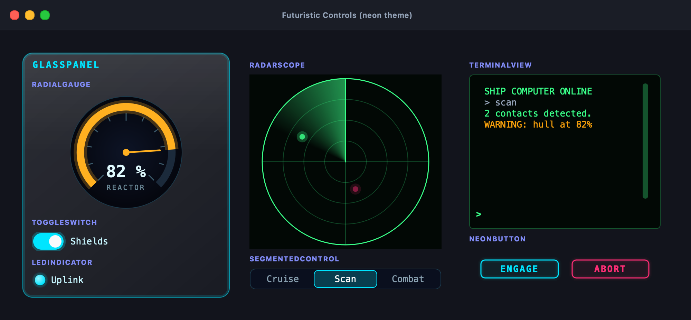
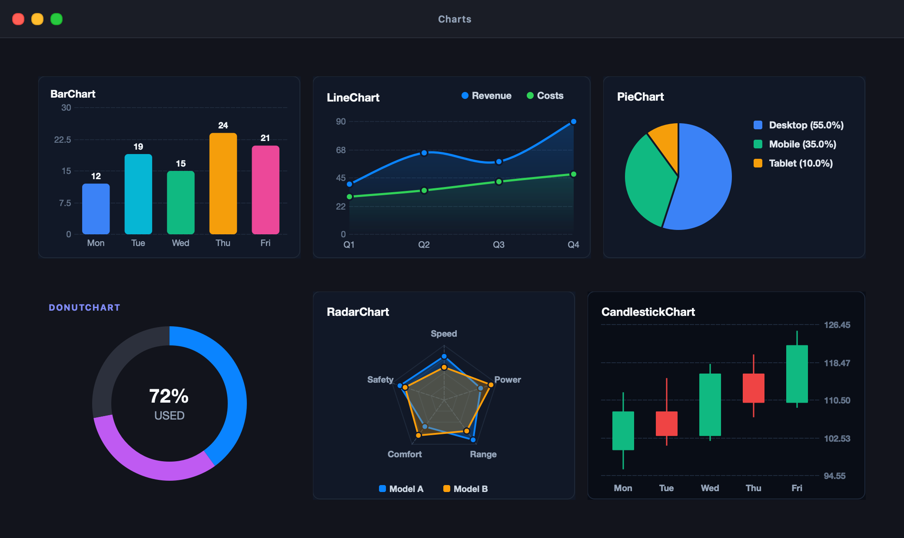
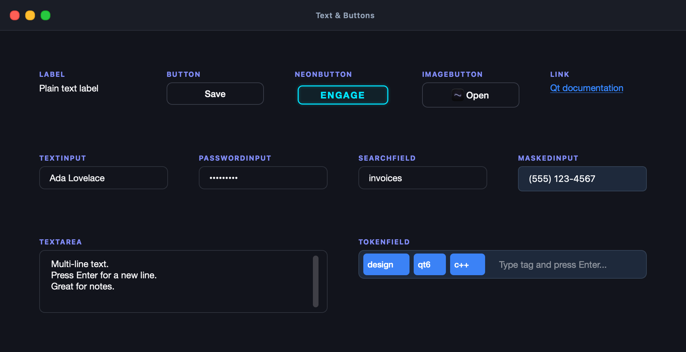
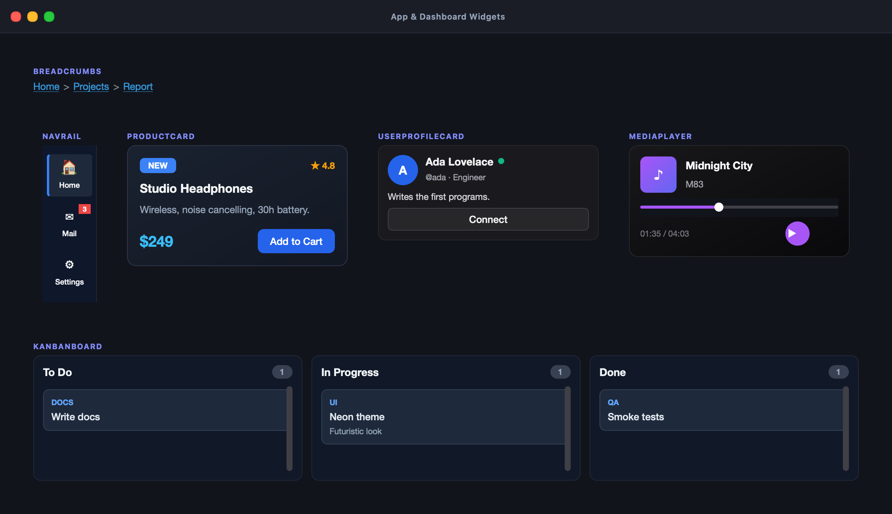
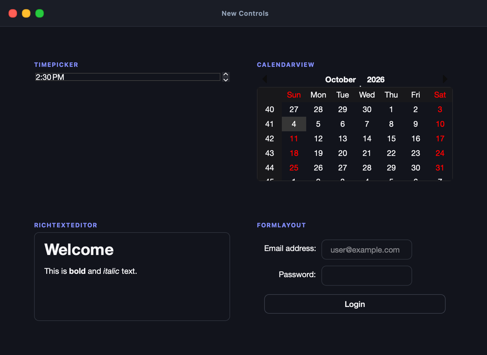
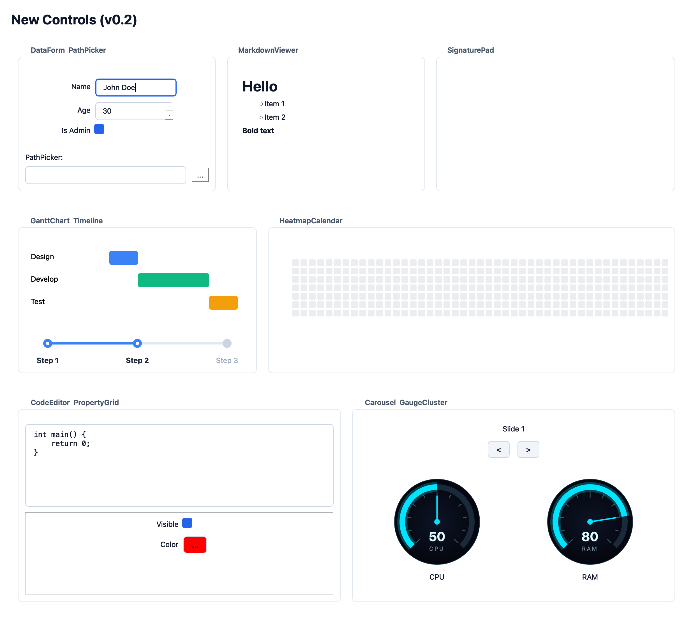

# EasyQt6 (SimpleGUI)

[](https://github.com/codecaine-zz/easy_qt6/actions/workflows/cmake.yml)

EasyQt6 is a lightweight C++ wrapper around Qt 6 Widgets. It aims to be as easy as **Visual
Basic, Delphi, Lazarus or vlang_simplegui**: you build desktop apps without touching raw Qt
classes, macros, or manual memory management. It runs on **macOS, Linux, Windows x64 and
Windows ARM64**.

## Features

- **No boilerplate.** No `Q_OBJECT`, no moc, no subclassing `QMainWindow` to show a button.
- **Familiar to RAD developers.** Delphi/VB-style names (`Edit`, `Memo`, `CheckBox`,
  `TrackBar`, `StringGrid`, `PageControl`…), a control `Name` + `find<T>()` lookup, menus,
  a status bar, `ShowMessage`/`InputBox`-style dialogs, a `Timer`, and `OnCloseQuery`.
- **86 controls.** Standard inputs, layouts, charts, dashboard cards, web/PDF/map views,
  and **futuristic controls**: `ToggleSwitch`, `RadialGauge`, `NeonButton`, `LedIndicator`,
  `RadarScope`, `TerminalView`, `SegmentedControl`, `GlassPanel`. Plus 11 new additions like `PropertyGrid`, `Carousel`, and `Timeline`.
- **Themes.** Modern dark/light, GNOME, KDE, Ubuntu, Windows 11 Fluent, and a **neon** sci-fi theme.
- **Safe by default.** Text is always plain text, colors are validated, links are limited to
  http/https/mailto, and out-of-range indexes are ignored instead of crashing.
- **Clean architecture.** PIMPL everywhere: your code never includes Qt headers. Controls are
  `std::shared_ptr`s, and every event returns a disconnectable `EventConnection`.

## Screenshots

| Analytics Dashboard | System Monitor |
| :---: | :---: |
|  |  |

| Futuristic controls (neon theme) | Charts |
| :---: | :---: |
|  |  |

| Text & buttons | App & dashboard widgets |
| :---: | :---: |
|  |  |

| New v0.2 Controls | New v0.2 Controls (Batch 2) |
| :---: | :---: |
|  |  |

Every control appears in one of the grouped pictures in [`screenshots/`](screenshots/), and each
group is shown in the [API Reference](docs/API_REFERENCE.md).

## Quick start

```cpp
#include "simplegui/simplegui.h"
using namespace simplegui;

int main(int argc, char* argv[]) {
    Application app(argc, argv);
    Window window("My App", 400, 200);

    auto label  = std::make_shared<Label>("Ready.");
    auto button = std::make_shared<Button>("Click me");
    button->on_click([label]() { label->set_text("You clicked the button!"); });

    auto column = std::make_shared<VBox>();
    column->add_child(label);
    column->add_child(button);

    window.set_content(column);
    window.show();
    return app.run();
}
```

Delphi / VB style works too:

```cpp
auto edit = std::make_shared<Edit>();          // same as TextInput
edit->set_name("NameEdit");
window.add_menu_item("File", "Greet", []() {
    show_message("Hello " + find<Edit>("NameEdit")->get_text());
}, "Ctrl+G");
window.on_close([]() { return ask_yes_no("Quit?"); });
```

## Documentation

The **[API Reference](docs/API_REFERENCE.md)** is a complete, beginner-friendly guide: install
steps, a line-by-line first program, a Delphi/Lazarus/VB/V translation table, and every
control, function, theme, dialog and alias.

## Building

You need a C++17 compiler, CMake 3.16+, and Qt 6 with the WebEngine module (Ninja optional).

```bash
# macOS example
brew install qt cmake ninja

cmake -S cpp -B cpp/build -G Ninja        # add -DCMAKE_PREFIX_PATH=<Qt dir> if Qt isn't found
cmake --build cpp/build
ctest --test-dir cpp/build                # optional self-tests (headless)
```

See the [API Reference](docs/API_REFERENCE.md#installing-and-building) for Linux and Windows.

## Examples

| Folder | Examples |
|---|---|
| [`cpp/examples_shared/`](cpp/examples_shared) | `mission_control` (futuristic dashboard), `classic_rad` (Delphi/VB-style contact book), `drawing_board` (Canvas and Image demo), `file_ninja` (fd/rip2 GUI alternative) |
| [`cpp/examples_macos/`](cpp/examples_macos) | `hello_world`, `minimal`, `login_form`, `calculator`, `web_browser`, `settings_dashboard`, `data_explorer`, `system_monitor`, `analytics_dashboard` |
| [`cpp/examples_linux/`](cpp/examples_linux) | `hello_world`, `calculator`, `system_monitor`, `software_center`, `terminal_config` |
| [`cpp/examples_windows/`](cpp/examples_windows) | `hello_world`, `calculator`, `system_monitor`, `settings_dashboard` |

After building, run them from `cpp/build/<folder>/<example>/`, for example:

```bash
./cpp/build/examples_shared/mission_control/example_mission_control
./cpp/build/examples_shared/classic_rad/example_classic_rad
open ./cpp/build/examples_macos/calculator/example_calculator.app        # macOS app bundles
./cpp/build/examples_linux/calculator/example_linux_calculator
./cpp/build/examples_windows/calculator/example_win_calculator
```

## Contributing

See [CONTRIBUTING.md](CONTRIBUTING.md). Changes are listed in [CHANGELOG.md](CHANGELOG.md).

## License

See [LICENSE](LICENSE).
