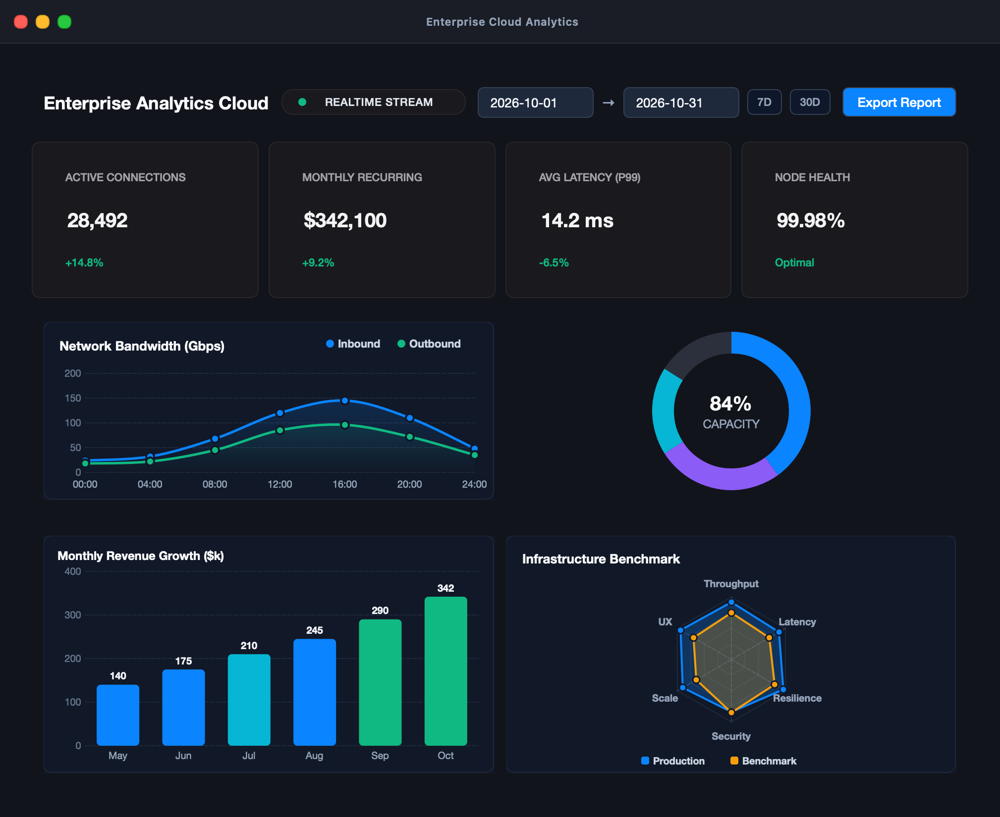
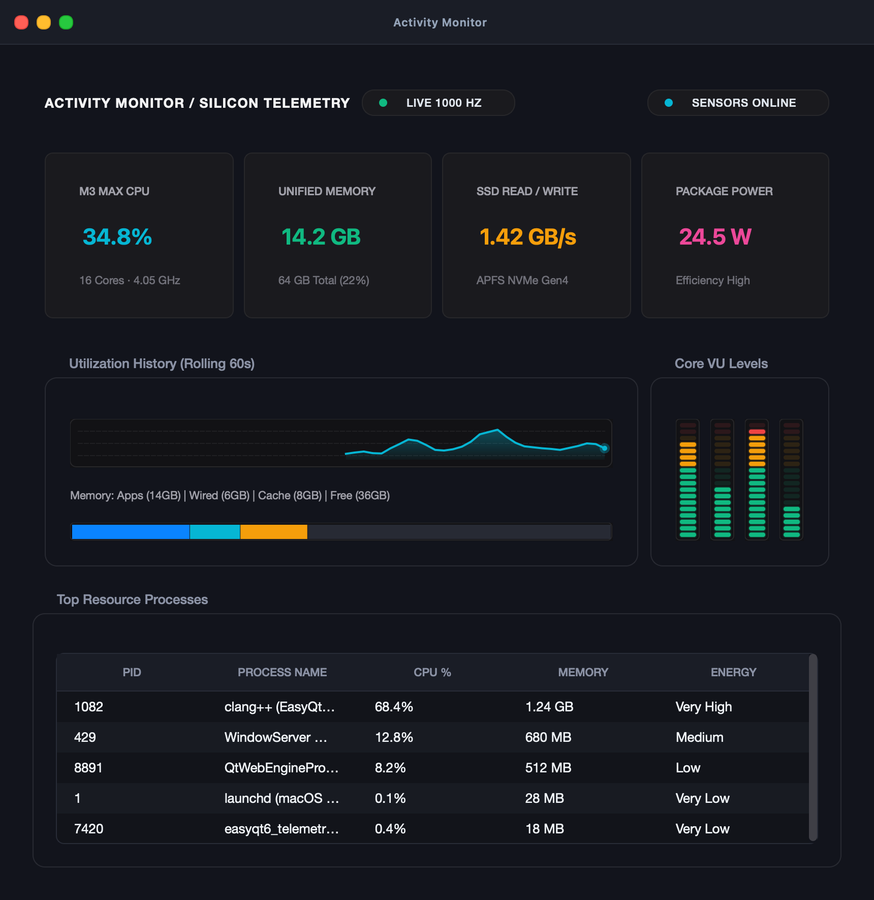
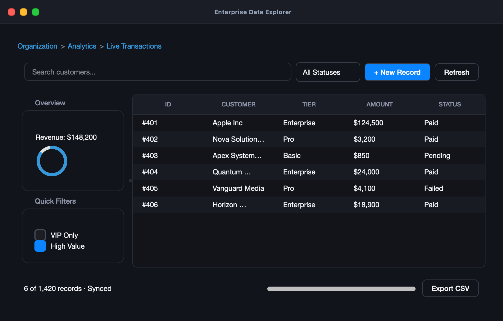
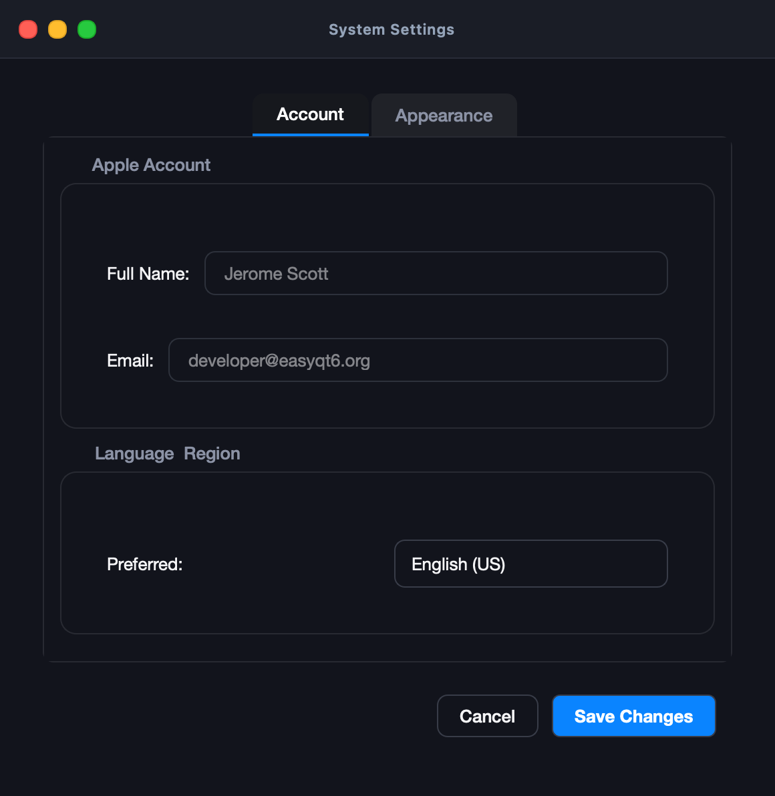

# EasyQt6

[](https://github.com/codecaine-zz/easy_qt6/actions/workflows/cmake.yml)

EasyQt6 is a modern, lightweight, and zero-boilerplate C++ wrapper around Qt6. It is designed to be as straightforward to use as Visual Basic or Delphi - allowing rapid UI development without touching raw Qt classes, macros, or memory management.

## Features

- **Zero Boilerplate**: No `Q_OBJECT` macros, no `MOC` headaches, and no need to subclass `QMainWindow` just to put a button on the screen.
- **PIMPL Architecture**: Your application code doesn't `#include` Qt headers. This keeps compile times blazingly fast and your namespace clean.
- **Modern C++**: Uses `std::shared_ptr` for memory-safe UI construction and `std::function` lambdas for inline, readable event handling.
- **Cross-Platform**: Powered by Qt6, runs seamlessly on macOS, Linux, and Windows.

## Screenshots & Showcase

| Enterprise Analytics & Charts Dashboard | System Telemetry Monitor (TMOG Inspired) |
| :---: | :---: |
|  |  |

| Enterprise Data Explorer (Mixed Layouts) | Application Preferences (Tabs & Sliders) |
| :---: | :---: |
|  |  |

### Controls, Graphics & Layouts

Every control and layout is captured with native Qt6 rendering in [`screenshots/`](screenshots/):
- **Graphics & Advanced Charts**: [BarChart](screenshots/bar_chart.png), [LineChart](screenshots/line_chart.png), [PieChart](screenshots/pie_chart.png), [Canvas (2D Vector Graphics)](screenshots/canvas.png), [RadarChart](screenshots/radar_chart.png), [CandlestickChart (Financial OHLC)](screenshots/candlestick_chart.png)
- **High-Level Composite & App Controls**: [KanbanBoard](screenshots/kanban_board.png), [UserProfileCard](screenshots/user_profile_card.png), [ProductCard](screenshots/product_card.png), [DonutChart](screenshots/donut_chart.png), [ActivityHeatmap](screenshots/activity_heatmap.png), [StatGrid](screenshots/stat_grid.png), [MediaPlayer](screenshots/media_player.png), [FeedbackMood](screenshots/feedback_mood.png), [DateRangePicker](screenshots/date_range_picker.png), [TokenField](screenshots/token_field.png), [MaskedInput](screenshots/masked_input.png), [NavRail](screenshots/nav_rail.png)
- **TMOG Precision Telemetry**: [Sparkline Graph](screenshots/sparkline.png), [VFD Segmented Meter](screenshots/vfd_meter.png), [StatCard Readout](screenshots/stat_card.png), [CompositionBar](screenshots/composition_bar.png), [StatusPill Badge](screenshots/status_pill.png)
- **Standard Controls**: [Button](screenshots/button.png), [Label](screenshots/label.png), [TextInput](screenshots/text_input.png), [PasswordInput](screenshots/password_input.png), [SearchField](screenshots/search_field.png), [Checkbox](screenshots/checkbox.png), [Radio](screenshots/radio.png), [Slider](screenshots/slider.png), [Dropdown](screenshots/dropdown.png), [ComboBox](screenshots/combo_box.png), [NumberInput](screenshots/number_input.png), [Knob](screenshots/knob.png), [DatePicker](screenshots/date_picker.png), [ColorWell](screenshots/color_well.png), [ProgressIndicator](screenshots/progress_indicator.png), [CircularProgress](screenshots/circular_progress.png), [Rating](screenshots/rating.png), [Breadcrumbs](screenshots/breadcrumbs.png), [Textarea](screenshots/textarea.png), [Link](screenshots/link.png)
- **Layouts**: [VBox](screenshots/vbox.png), [HBox](screenshots/hbox.png), [Grid](screenshots/grid.png), [GroupBox](screenshots/group_box.png), [TabView](screenshots/tab_view.png), [SplitView](screenshots/split_view.png), [ScrollView](screenshots/scroll_view.png)

## Quick Start

See the `cpp/examples` folder for copy-paste-ready RAD templates:

- `analytics_dashboard`: **Executive telemetry & data analytics dashboard** featuring `LineChart`, `BarChart`, `RadarChart`, `DonutChart`, `StatGrid`, and `DateRangePicker`.
- `system_monitor`: **TMOG-inspired precision telemetry monitor** with live rolling `Sparkline`, glowing `VfdMeter` core levels, `StatCard` readouts, and `CompositionBar`.
- `settings_dashboard`: **Advanced mixed layouts** combining tabs, group boxes, form rows, knobs, sliders, and bottom action bar.
- `data_explorer`: **Advanced mixed layouts** combining breadcrumbs, search toolbar, split sidebar, data grid, and status bar.
- `hello_world`: The absolute bare minimum to get a window on screen.
- `login_form`: Demonstrates layouts, checkboxes, and input masking.
- `calculator`: Demonstrates dynamic UI building with loops and grids.
- `web_browser`: A fully functional mini browser using `QtWebEngine` in under 40 lines.

### Example

```cpp
#include "simplegui/application.h"
#include "simplegui/window.h"
#include "simplegui/button.h"
#include "simplegui/label.h"
#include "simplegui/vbox.h"

int main(int argc, char* argv[]) {
    simplegui::Application app(argc, argv);
    simplegui::Window window("My App", 400, 300);

    auto layout = std::make_shared<simplegui::VBox>();
    auto label = std::make_shared<simplegui::Label>("Ready.");
    auto btn = std::make_shared<simplegui::Button>("Click Me!");

    btn->on_click([label]() {
        label->set_text("You clicked the button!");
    });

    layout->add_child(label);
    layout->add_child(btn);
    
    window.set_content(layout);
    window.show();
    
    return app.run();
}
```

## Documentation

Check the full [API Reference](docs/API_REFERENCE.md) to see all supported layouts, controls, and advanced web views.

## Building

### Dependencies (macOS)

Before building, you must install the Qt6 framework and the required build tools using Homebrew:

```bash
brew install qt cmake ninja
```

### Compile

```bash
# Generate the build system
cmake -S cpp -B cpp/build -G Ninja

# Compile the library and all platform examples
cmake --build cpp/build
```

### Running Examples

EasyQt6 provides dedicated example suites designed natively for macOS, Linux, and Windows:

#### macOS Examples (`cpp/examples_macos/`)
- **Calculator**: `./cpp/build/examples_macos/calculator/example_calculator.app/Contents/MacOS/example_calculator`
- **Analytics Dashboard**: `./cpp/build/examples_macos/analytics_dashboard/example_analytics_dashboard.app/Contents/MacOS/example_analytics_dashboard`
- **Data Explorer**: `./cpp/build/examples_macos/data_explorer/example_data_explorer.app/Contents/MacOS/example_data_explorer`
- **System Monitor**: `./cpp/build/examples_macos/system_monitor/example_system_monitor.app/Contents/MacOS/example_system_monitor`
- **Settings Dashboard**: `./cpp/build/examples_macos/settings_dashboard/example_settings_dashboard.app/Contents/MacOS/example_settings_dashboard`
- **Web Browser**: `./cpp/build/examples_macos/web_browser/example_web_browser.app/Contents/MacOS/example_web_browser`
- **Login Form**: `./cpp/build/examples_macos/login_form/example_login_form.app/Contents/MacOS/example_login_form`
- **Hello World**: `./cpp/build/examples_macos/hello_world/example_hello_world.app/Contents/MacOS/example_hello_world`

#### Linux Examples (`cpp/examples_linux/`)
- **Libadwaita System Monitor**: `./cpp/build/examples_linux/system_monitor/example_linux_system_monitor`
- **GNOME Calculator**: `./cpp/build/examples_linux/calculator/example_linux_calculator`
- **GNOME Software**: `./cpp/build/examples_linux/software_center/example_linux_software_center`
- **Console Preferences**: `./cpp/build/examples_linux/terminal_config/example_linux_terminal_config`
- **Hello GNOME**: `./cpp/build/examples_linux/hello_world/example_linux_hello_world`

#### Windows Examples (`cpp/examples_windows/`)
- **Windows 11 Task Manager**: `./cpp/build/examples_windows/system_monitor/example_win_system_monitor`
- **Fluent Calculator**: `./cpp/build/examples_windows/calculator/example_win_calculator`
- **WinUI 3 Settings Dashboard**: `./cpp/build/examples_windows/settings_dashboard/example_win_settings_dashboard`
- **Hello Fluent**: `./cpp/build/examples_windows/hello_world/example_win_hello_world`
