# SimpleGUI (EasyQt6) — Complete Guide & API Reference

> **Who is this for?** Everyone. If you have never written a program before, start at
> [Part 1](#part-1--getting-started). If you know Delphi, Lazarus, Visual Basic or
> vlang_simplegui, jump to [Coming from another tool](#coming-from-delphi-lazarus-visual-basic-or-v).
> Every feature in the library is listed in this one document.

---

## Table of contents

**Part 1 — Getting started**
1. [What is SimpleGUI?](#what-is-simplegui)
2. [Installing and building](#installing-and-building)
3. [Your first program, line by line](#your-first-program-line-by-line)
4. [The five ideas you need](#the-five-ideas-you-need)
5. [A tiny bit of C++ (just enough)](#a-tiny-bit-of-c-just-enough)
6. [Coming from Delphi, Lazarus, Visual Basic or V](#coming-from-delphi-lazarus-visual-basic-or-v)

**Part 2 — The basics every program uses**
7. [Application (and themes)](#application)
8. [Window (menus, status bar, closing)](#window)
9. [Things every control can do](#things-every-control-can-do)
10. [Events and EventConnection](#events-and-eventconnection)
11. [Naming controls and finding them later](#naming-controls-and-finding-them-later)
12. [Colors](#colors)

**Part 3 — Controls**
13. [Layouts (arranging controls)](#layouts)
14. [Text and buttons](#text-and-buttons)
15. [Choices (yes/no, pick one, lists)](#choices)
16. [Numbers, dates and colors](#numbers-dates-and-colors)
17. [Progress and status](#progress-and-status)
18. [Futuristic controls](#futuristic-controls)
19. [Pictures and drawing](#pictures-and-drawing)
20. [Tables](#tables)
21. [Charts](#charts)
22. [Dashboard and app widgets](#dashboard-and-app-widgets)
23. [Web pages, PDFs and maps](#web-pages-pdfs-and-maps)

**Part 4 — Extra tools**
24. [Dialogs (message boxes, input boxes, file pickers)](#dialogs)
25. [Timer and run_later](#timer-and-run_later)
26. [Familiar names (aliases)](#familiar-names-aliases)
27. [Styling with style sheets](#styling-with-style-sheets)
28. [Safety built in](#safety-built-in)
29. [Example programs](#example-programs)
30. [Troubleshooting and FAQ](#troubleshooting-and-faq)
31. [Advanced: mixing in raw Qt](#advanced-mixing-in-raw-qt)

---

# Part 1 — Getting started

## What is SimpleGUI?

SimpleGUI lets you build **desktop programs with windows, buttons, text boxes, charts and
more** using only a few lines of C++. It runs on **macOS, Linux and Windows** (x64 and ARM64).

Under the hood it uses [Qt 6](https://www.qt.io/), a professional toolkit used by thousands of
companies — but you never have to learn Qt. SimpleGUI hides all of the complicated parts, in
the same spirit as Visual Basic, Delphi and Lazarus.

Everything lives in the `simplegui` namespace, and one line gives you all of it:

```cpp
#include "simplegui/simplegui.h"
```

## Installing and building

You need three things: a **C++17 compiler**, **CMake**, and **Qt 6** (with the *WebEngine*
module). Ninja is optional but makes builds faster.

| System | How to install the tools |
|---|---|
| macOS | Install Xcode Command Line Tools (`xcode-select --install`), then `brew install qt cmake ninja` |
| Ubuntu / Debian | `sudo apt install build-essential cmake ninja-build qt6-base-dev qt6-webengine-dev` |
| Fedora | `sudo dnf install gcc-c++ cmake ninja-build qt6-qtbase-devel qt6-qtwebengine-devel` |
| Windows (x64 or ARM64) | Install Visual Studio 2022 (C++ workload) and Qt 6 from the Qt online installer (tick *Qt WebEngine*) |

Then, from the project folder:

```bash
cmake -S cpp -B cpp/build -G Ninja       # 1. prepare (only needed once)
cmake --build cpp/build                  # 2. compile the library, examples and tests
ctest --test-dir cpp/build               # 3. (optional) run the self-tests
```

> **Tip:** If CMake can't find Qt, tell it where Qt lives, for example
> `-DCMAKE_PREFIX_PATH=/opt/homebrew/opt/qt` (macOS) or `-DCMAKE_PREFIX_PATH=C:/Qt/6.7.0/msvc2019_64` (Windows).

### Adding your own program

Make a folder such as `cpp/examples_shared/my_app/` with a `main.cpp` and this `CMakeLists.txt`:

```cmake
add_executable(my_app main.cpp)
target_link_libraries(my_app PRIVATE simplegui)
```

Then add `add_subdirectory(my_app)` to `cpp/examples_shared/CMakeLists.txt` and build again.

## Your first program, line by line

```cpp
#include "simplegui/simplegui.h"                 // 1. bring in SimpleGUI
using namespace simplegui;                       // 2. so we can write Button instead of simplegui::Button

int main(int argc, char* argv[]) {
    Application app(argc, argv);                 // 3. every program starts with one Application
    Window window("My First App", 400, 200);     // 4. a window: title, width, height

    auto label  = std::make_shared<Label>("Hello!");        // 5. create a label
    auto button = std::make_shared<Button>("Click me");     // 6. create a button

    button->on_click([label]() {                 // 7. when the button is clicked...
        label->set_text("You clicked it!");      //    ...change the label's text
    });

    auto column = std::make_shared<VBox>();      // 8. a column that stacks controls top to bottom
    column->add_child(label);
    column->add_child(button);

    window.set_content(column);                  // 9. put the column inside the window
    window.show();                               // 10. show the window
    return app.run();                            // 11. keep the program running until the window closes
}
```

That's the pattern for **every** SimpleGUI program:
**create the Application → create a Window → create controls → arrange them in a layout →
react to events → show → run.**

## The five ideas you need

| Idea | Plain-English meaning | In SimpleGUI |
|---|---|---|
| **Application** | The program itself. There is exactly one. | `Application app(argc, argv);` |
| **Window** | A box on the screen with a title bar (a *form* in Delphi/VB). | `Window window("Title", 640, 480);` |
| **Control** | Anything you can see: a button, a label, a chart… (a *component* or *widget*). | `std::make_shared<Button>("OK")` |
| **Layout** | An invisible organiser that places controls in a column, row, tabs, etc. | `VBox`, `HBox`, `GroupBox`, `TabView` … |
| **Event** | Something the user does (click, type, drag) that runs your code. | `button->on_click(...)` |

## A tiny bit of C++ (just enough)

| You see | It means |
|---|---|
| `auto x = ...;` | "Make a variable called `x`; work out its type for me." |
| `std::make_shared<Button>("OK")` | "Create a new Button with the caption OK." SimpleGUI cleans it up automatically — you never `delete` anything. |
| `x->set_text("Hi")` | Call a function on a control you created with `make_shared` (use `->`). |
| `window.show()` | Call a function on something created directly, like `Window window(...)` (use `.`). |
| `[label]() { ... }` | A **lambda** — a small piece of code you hand to an event. Names inside `[ ]` are the controls the code is allowed to use. |
| `[&window]() { ... }` | Same, but uses `window` itself instead of a copy. Use `&` for things like `Window` and `Timer` that live in `main`. |
| `"text"` / `std::string` | A piece of text. Join texts with `+`: `"Hello " + name`. |
| `std::to_string(42)` | Turns a number into text: `"42"`. |
| `{"Red", "Green", "Blue"}` | A list of items (a `std::vector`). |
| `true` / `false` | Yes / no. |
| `// comment` | A note for humans; the computer ignores it. |

## Coming from Delphi, Lazarus, Visual Basic or V

SimpleGUI deliberately uses the ideas you already know.

| You know (Delphi / Lazarus / VB / V) | SimpleGUI |
|---|---|
| `Application.Initialize; Application.Run;` | `Application app(argc, argv); return app.run();` |
| `TForm` / `Form1` | `Window` |
| `Form1.Caption := 'Hi'` | `window.set_title("Hi")` |
| `Button1.Caption := 'OK'` | `button->set_text("OK")` |
| `Edit1.Text` | `edit->get_text()` / `edit->set_text(...)` |
| `Button1.OnClick := ...` / `Sub Button1_Click()` | `button->on_click([](){ ... });` |
| `Button1.Enabled := False` | `button->set_enabled(false)` |
| `Button1.Visible := False` | `button->set_visible(false)` or `button->hide()` |
| `Button1.Hint := '...'` | `button->set_tooltip("...")` |
| Object Inspector **Name** (`Edit1`) / V widget id | `edit->set_name("Edit1")`, later `find<Edit>("Edit1")` |
| `TPanel` with `Align := alTop` | `VBox` / `HBox` (layouts place controls automatically — no pixel positions) |
| `TMainMenu` / VB menu editor | `window.add_menu_item("File", "Open", handler, "Ctrl+O")` |
| `TStatusBar` | `window.set_status_text("Ready")` |
| `OnCloseQuery` / `Form_QueryUnload` | `window.on_close([]{ return ask_yes_no("Quit?"); })` |
| `ShowMessage` / `MsgBox` | `show_message("Hello")` |
| `MessageDlg(... mbYesNo)` | `ask_yes_no("Are you sure?")` |
| `InputBox` | `input_box("Your name?")` |
| `TOpenDialog` / `TSaveDialog` | `open_file_dialog()` / `save_file_dialog()` |
| `TTimer` with `OnTimer` | `Timer` with `on_tick` |
| `Application.ProcessMessages` / `DoEvents` | `Application::process_events()` |
| `Application.Terminate` / `End` | `Application::quit()` |

Many classes also have the names you are used to — `Edit`, `Memo`, `CheckBox`, `TrackBar`,
`StringGrid`, `PageControl`, `PaintBox`, `Panel`, `Row`, `Column` and more. See
[Familiar names](#familiar-names-aliases).

---

# Part 2 — The basics every program uses

## Application

Create exactly one, first thing in `main`. It also controls the program-wide **theme**.

```cpp
Application app(argc, argv);
app.set_theme("neon");          // futuristic dark look
app.set_app_name("My Tool");
return app.run();
```

| Function | What it does |
|---|---|
| `Application(argc, argv)` | Starts SimpleGUI. Must come before any window or control. |
| `run()` | Shows your program and waits until the last window closes. Returns the exit code. |
| `set_theme(name)` | Changes the look of every window. Returns `false` if the name is unknown. |
| `theme()` | The name of the last theme you applied. |
| `Application::available_themes()` | A list of every theme name (see below). |
| `set_stylesheet(qss)` | Advanced: apply your own CSS-like style sheet to the whole program. |
| `set_app_name(name)` | The program name shown in dialogs and the task bar. |
| `set_font(family, point_size = 0)` | Default font for everything, e.g. `set_font("Inter", 11)`. `0` keeps the current size. |
| `Application::quit(code = 0)` | Ends the program from anywhere. |
| `Application::process_events()` | Lets the screen refresh during a long loop. |

### Themes

| Theme name(s) | Look |
|---|---|
| `"dark"`, `"modern_dark"`, `"apple"`, `"apple_dark"` | Modern dark (macOS style) |
| `"light"`, `"modern_light"` | Modern light |
| `"neon"`, `"cyber"`, `"futuristic"` | Futuristic neon on black — pairs with the [futuristic controls](#futuristic-controls) |
| `"linux"`, `"adwaita"`, `"linux_adwaita"`, `"gnome"` | GNOME / libadwaita dark |
| `"breeze"`, `"kde"`, `"linux_breeze"` | KDE Breeze dark |
| `"yaru"`, `"ubuntu"`, `"linux_yaru"` | Ubuntu Yaru dark |
| `"windows"`, `"fluent"`, `"windows_dark"`, `"win11"` | Windows 11 Fluent |
| `"default"` | The operating system's own look (no theme) |

## Window

A window holds **one** control — usually a layout (`VBox`, `HBox`…) that holds everything else.

```cpp
Window window("Notes", 800, 600);
window.set_content(column);
window.add_menu_item("File", "Quit", [&window]() { window.close(); }, "Ctrl+Q");
window.set_status_text("Ready");
window.center();
window.show();
```

| Function | What it does |
|---|---|
| `Window(title = "SimpleGUI", width = 640, height = 480)` | Creates a window (hidden until `show()`). |
| **Content** | |
| `set_content(control)` | Puts a control (usually a layout) inside the window, replacing what was there. |
| `content()` | The control currently inside the window. |
| **Showing and hiding** | |
| `show()` / `hide()` | Show or hide the window. |
| `close()` | Close it, exactly like clicking the close button (runs `on_close` first). |
| `is_visible()` | `true` while the window is on screen. |
| `maximize()` / `minimize()` | Make it fill the screen / shrink it to the task bar or dock. |
| `set_fullscreen(true/false)` | Enter or leave full-screen mode. |
| **Title, size and position** | |
| `set_title(text)` / `title()` | Change / read the title bar text. |
| `set_size(w, h)` | Resize the window. |
| `set_min_size(w, h)` | The user can't make it smaller than this. |
| `set_fixed_size(w, h)` | The user can't resize it at all. |
| `width()` / `height()` | Current size in pixels. |
| `set_position(x, y)` | Move the top-left corner to a spot on the screen. |
| `center()` | Move the window to the middle of the screen. |
| `set_icon(image_path)` | Window/task-bar icon. Returns `false` if the picture can't be loaded. |
| **Status bar and menus** | |
| `set_status_text(text)` | Shows text in a status bar at the bottom (created on first use). |
| `add_menu_item(menu, item, handler, shortcut = "")` | Adds `item` to the menu called `menu` (created on first use). Shortcut examples: `"Ctrl+S"`, `"Ctrl+Shift+N"`, `"F5"`. On macOS `Ctrl` means ⌘ Cmd. Returns an [EventConnection](#events-and-eventconnection). |
| `add_menu_separator(menu)` | Adds a dividing line to a menu. |
| **Events** | |
| `on_close(handler)` | Runs when the user tries to close. The handler returns `true` to allow closing or `false` to keep the window open. |
| **Other** | |
| `save_screenshot(file_path)` | Saves a picture of the window as `.png` or `.jpg`. Returns `false` on failure. |

```cpp
// "Save changes?" before closing (Delphi: OnCloseQuery)
window.on_close([]() {
    return ask_yes_no("Quit without saving?");
});
```

## Things every control can do

Every control — buttons, labels, charts, even layouts — has these functions.

| Function | What it does |
|---|---|
| **Enabled and visible** | |
| `set_enabled(true/false)` / `is_enabled()` | `false` greys the control out so it can't be used. |
| `set_visible(true/false)` / `is_visible()` | `false` hides it (it takes no space). |
| `show()` / `hide()` | Shortcuts for `set_visible(true)` / `set_visible(false)`. |
| **Size (pixels)** | |
| `set_width(w)` / `set_height(h)` | Fix the width or height. |
| `set_size(w, h)` | Fix both. |
| `set_min_size(w, h)` | Never smaller than this. |
| `set_max_size(w, h)` | Never larger than this. |
| `width()` / `height()` | Current on-screen size. |
| **Look** | |
| `set_tooltip(text)` / `tooltip()` | Hint text shown when the mouse hovers (Delphi: *Hint*). |
| `set_text_color(color)` | Text color, e.g. `"#ff0000"` or `"red"`. |
| `set_background_color(color)` | Background color. |
| `set_font_size(pixels)` | Text size. |
| `set_bold(true/false)` | Bold text. |
| `set_font(family)` | Font name, e.g. `"Courier New"`. |
| `set_style(css)` | Advanced: a Qt style sheet. See [Styling](#styling-with-style-sheets). |
| **Keyboard** | |
| `set_focus()` | Put the typing cursor in this control. |
| `has_focus()` | `true` if it has the typing cursor. |
| **Names** | |
| `set_name(name)` / `name()` | Give it a name you can [look up later](#naming-controls-and-finding-them-later). |

## Events and EventConnection

An **event** is something the user does. Every function that starts with `on_` lets you choose
what code runs when it happens:

```cpp
button->on_click([]() {
    show_message("Clicked!");
});

slider->on_change([label](int value) {           // some events hand you a value
    label->set_text("Volume: " + std::to_string(value));
});
```

- You can attach **several** handlers to the same event; they all run, in order.
- Like Delphi's `OnChange`, the standard input controls (text boxes, sliders, check boxes,
  drop-downs, number boxes, date pickers, tabs) also fire `on_change` when *your code* changes
  their value. Functions marked **"does not fire"** in the tables below (for example
  `ToggleSwitch::set_on`, `SegmentedControl::set_selected_index`, `NavRail::set_selected`)
  change the value silently; `NeonButton::click()` and `ToggleSwitch::toggle()` fire on purpose.

Every `on_...` function gives back an **EventConnection** "ticket". You can ignore it.
Keep it if you want to switch the handler off later:

```cpp
EventConnection ticket = button->on_click([]() { /* ... */ });
// later...
ticket.disconnect();              // the handler no longer runs
```

| EventConnection function | What it does |
|---|---|
| `disconnect()` | Stops the handler. Safe to call twice, and safe even after the control is gone. |
| `connected()` | `true` until you call `disconnect()`. |

> Throwing the ticket away does **not** disconnect anything — the handler keeps working for as
> long as the control exists.

## Naming controls and finding them later

Just like the **Name** property in Delphi/Lazarus or widget IDs in vlang_simplegui, you can name
a control and fetch it from anywhere:

```cpp
auto edit = std::make_shared<Edit>();
edit->set_name("NameEdit");

// ...anywhere else in your program:
if (auto e = find<Edit>("NameEdit")) {
    show_message("Hello " + e->get_text());
}
```

| Function | What it does |
|---|---|
| `find<Type>(name)` | Returns the control with that name, or `nullptr` if there is none or it is a different type. |
| `find_control(name)` | Same, but returns a plain `Control` (any type). |

## Colors

Anywhere a function asks for a color, you can write:

- a hex code: `"#3b82f6"`, `"#fff"`, or with transparency `"#803b82f6"` (`#AARRGGBB`)
- a color name: `"red"`, `"teal"`, `"orange"`, `"white"` … (all standard web color names)

Invalid colors are simply ignored, so a typo can never crash your program.

---

# Part 3 — Controls

Each control below shows a picture (when available), a short example and **every** function it
has. Remember: every control *also* has the [common functions](#things-every-control-can-do).

## Layouts

Layouts arrange other controls for you, so windows resize nicely. You never position things
by pixel coordinates.

**Stretch** — `add_child(control, stretch)`: a child with stretch `1` grows to fill spare
space; stretch `2` grows twice as much; `0` (the default) keeps its natural size.

### VBox — a column

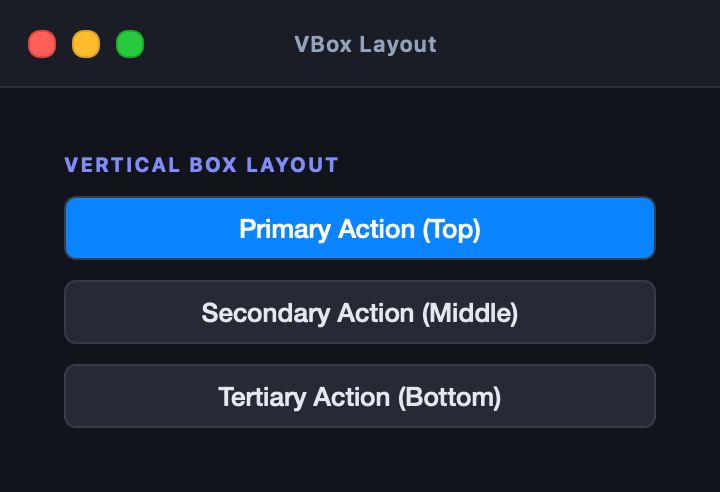

Stacks controls **top to bottom**. *Also known as:* `Column`, `Panel`.

```cpp
auto column = std::make_shared<VBox>();
column->set_margins(12);
column->set_spacing(8);
column->add_child(title);
column->add_child(editor, 1);     // the editor grows to fill the height
column->add_stretch();            // a spring that pushes the rest down
```

| Function | What it does |
|---|---|
| `VBox()` | Creates an empty column. |
| `add_child(control, stretch = 0)` | Adds a control at the bottom. |
| `add_stretch(stretch = 0)` | Adds an invisible spring that takes up spare space. |
| `add_spacing(pixels)` | Adds a fixed empty gap. |
| `remove_child(control)` | Takes a control out (the control itself still exists). |
| `clear()` | Removes every child. |
| `child_count()` | How many children it has. |
| `set_spacing(pixels)` | Gap between children. |
| `set_margins(pixels)` | Empty border on all four sides. |
| `set_margins(left, top, right, bottom)` | Different border on each side. |

### HBox — a row

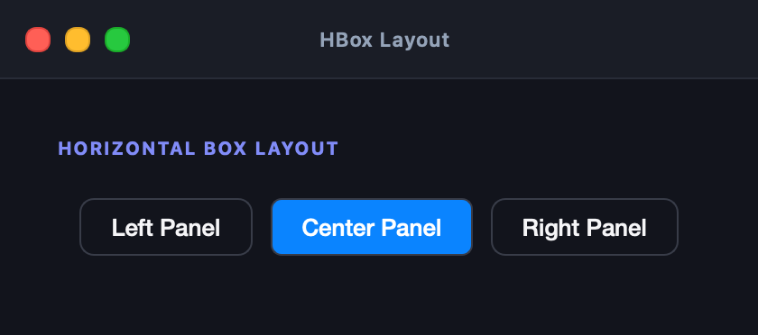

Places controls **side by side, left to right**. *Also known as:* `Row`. Same functions as
`VBox` (`add_child`, `add_stretch`, `add_spacing`, `remove_child`, `clear`, `child_count`,
`set_spacing`, `set_margins`).

```cpp
auto buttons = std::make_shared<HBox>();
buttons->add_stretch();           // push the buttons to the right
buttons->add_child(cancel);
buttons->add_child(ok);
```

### GroupBox — a titled frame

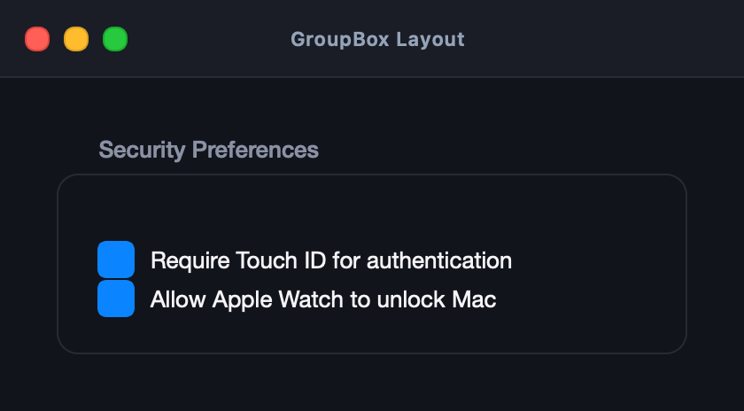

A border with a title that groups related controls (stacked top to bottom). *Also known as:* `Frame`.

| Function | What it does |
|---|---|
| `GroupBox(title = "")` | Creates the frame. |
| `add_child(control, stretch = 0)` / `add_stretch(stretch = 0)` / `add_spacing(pixels)` | Same as `VBox`. |
| `remove_child(control)` / `clear()` | Remove one / all children. |
| `set_title(text)` / `get_title()` | Change / read the title. |
| `set_spacing(pixels)` / `set_margins(pixels)` | Gaps inside the frame. |

### GlassPanel — a futuristic frosted card

See [Futuristic controls → GlassPanel](#glasspanel).

### TabView — pages with tabs

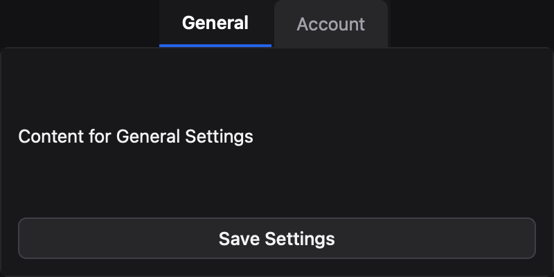

*Also known as:* `PageControl`, `TabControl`, `Notebook`.

```cpp
auto tabs = std::make_shared<TabView>();
tabs->add_tab("General", general_page);    // each page is usually a VBox
tabs->add_tab("Advanced", advanced_page);
tabs->on_change([](int index) { /* index 0 = first tab */ });
```

| Function | What it does |
|---|---|
| `TabView()` | Creates an empty tab view. |
| `add_tab(title, content)` | Adds a page. |
| `tab_count()` | Number of pages. |
| `current_index()` / `set_current_index(i)` | Which page is showing (0 = first, -1 = none). |
| `set_tab_title(i, title)` | Rename a tab. |
| `on_change(handler(int index))` | Runs when the user switches tabs. |

### SplitView — resizable panes

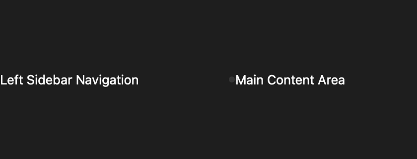

Two or more panes with a bar between them that the user can drag. *Also known as:* `Splitter`.

| Function | What it does |
|---|---|
| `SplitView(horizontal = true)` | `true` = side by side, `false` = top and bottom. |
| `add_child(control)` | Adds the next pane. |
| `set_sizes(first, second)` | Starting sizes in pixels, e.g. `set_sizes(200, 600)`. |
| `set_sizes({a, b, c})` | Starting sizes for three or more panes. |

### ScrollView — scroll bars

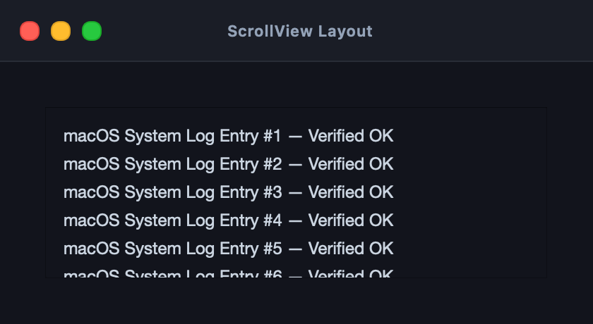

Adds scroll bars around one large control (usually a `VBox` full of controls).
*Also known as:* `ScrollBox`, `ScrollArea`.

| Function | What it does |
|---|---|
| `ScrollView()` | Creates the scroll area. |
| `set_content(control)` | The control to scroll. |
| `scroll_to_top()` / `scroll_to_bottom()` | Jump to the start / end. |

## Text and buttons

### Label

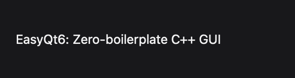

Shows text. Text is always shown exactly as written (never treated as HTML).
*Also known as:* `StaticText`.

| Function | What it does |
|---|---|
| `Label(text = "")` | Creates a label. |
| `set_text(text)` / `get_text()` | Change / read the text. |
| `set_alignment(where)` | `"left"`, `"center"` or `"right"`. |
| `set_word_wrap(true/false)` | Long text wraps onto several lines. |
| `set_selectable(true/false)` | Let the user select and copy the text. |

### Button

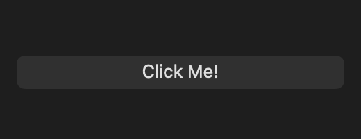

*Also known as:* `CommandButton`, `PushButton`.

```cpp
auto save = std::make_shared<Button>("Save");
save->on_click([]() { show_info("Saved!"); });
```

| Function | What it does |
|---|---|
| `Button(text)` | Creates a button with a caption. |
| `set_text(text)` / `get_text()` | Change / read the caption. |
| `on_click(handler())` | Runs when the button is clicked. |

### NeonButton

A glowing futuristic button — see [Futuristic controls → NeonButton](#neonbutton).

### ImageButton

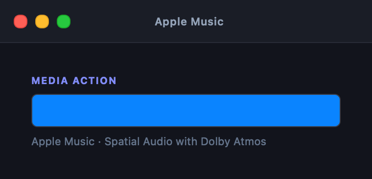

A button showing a picture/icon. *Also known as:* `BitBtn`, `SpeedButton`.

| Function | What it does |
|---|---|
| `ImageButton(image_path, tooltip = "")` | Creates the button from a picture file. |
| `set_image(image_path)` | Change the picture. Returns `false` if it can't be loaded. |
| `set_icon_size(pixels)` | Icon size. |
| `set_text(text)` | Optional caption next to the icon. |
| `on_click(handler())` | Runs when clicked. |

### Link

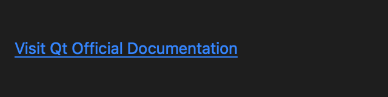

Underlined text that opens a web page in the user's browser. For safety only `http://`,
`https://` and `mailto:` addresses are opened. *Also known as:* `HyperLink`, `LinkLabel`.

| Function | What it does |
|---|---|
| `Link(text, url)` | Creates the link. |
| `set_text(text)` / `get_text()` | The visible text. |
| `set_url(url)` / `get_url()` | The address. |
| `on_click(handler(url))` | Runs when clicked (in addition to opening the browser). |

### TextInput — one-line text box

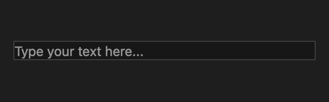

*Also known as:* `Edit`, `TextBox`, `LineEdit`.

```cpp
auto name = std::make_shared<TextInput>("Your name");   // grey hint while empty
name->on_enter([](const std::string& text) { show_message("Hi " + text); });
```

| Function | What it does |
|---|---|
| `TextInput(placeholder = "")` | Creates the box with a grey hint. |
| `get_text()` / `set_text(text)` | Read / change the text. |
| `set_placeholder(text)` | Change the grey hint. |
| `set_read_only(true/false)` | Can select and copy, but not type. |
| `set_max_length(n)` | Limit how many characters can be typed. |
| `clear()` | Empty the box. |
| `on_change(handler(text))` | Runs on every key press. |
| `on_enter(handler(text))` | Runs when the user presses Enter. |

### PasswordInput

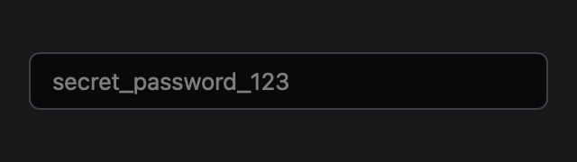

Like `TextInput` but shows dots. *Also known as:* `PasswordEdit`.

| Function | What it does |
|---|---|
| `PasswordInput(placeholder = "")` | Creates the box. |
| `get_text()` / `set_text(text)` / `set_placeholder(text)` / `clear()` | As `TextInput`. |
| `set_reveal(true/false)` | Temporarily show the real characters. |
| `on_change(handler(text))` / `on_enter(handler(text))` | As `TextInput`. |

### SearchField

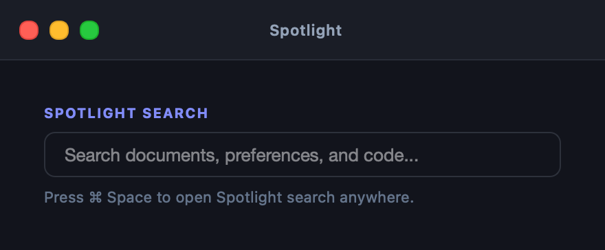

A search box with a built-in ✕ clear button.

| Function | What it does |
|---|---|
| `SearchField(placeholder = "Search...")` | Creates the box. |
| `get_text()` / `set_text(text)` / `set_placeholder(text)` / `clear()` | As `TextInput`. |
| `on_change(handler(text))` | Runs on every key press — great for "filter as you type". |
| `on_enter(handler(text))` | Runs when Enter is pressed. |

### MaskedInput — fixed-pattern box

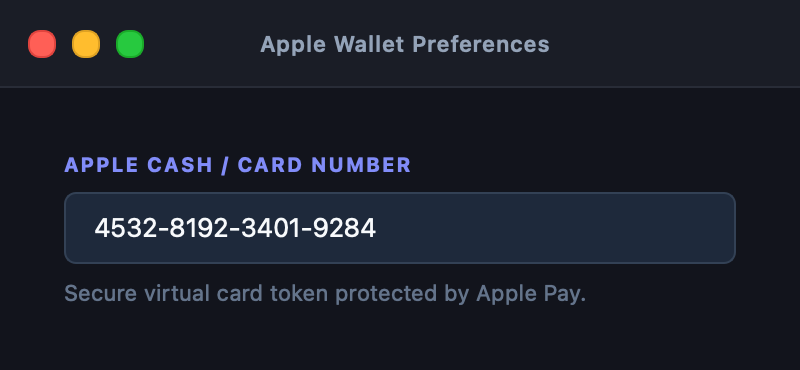

Only accepts text matching a pattern, such as a phone number. *Also known as:* `MaskEdit`.

| Mask character | Means |
|---|---|
| `9` | a digit is required |
| `0` | a digit is optional |
| `A` | a letter is required |
| `a` | a letter is optional |
| `N` | a letter or digit is required |
| `X` | any character is required |
| anything else | shown as-is, e.g. `(`, `)`, `-` |

```cpp
auto phone = std::make_shared<MaskedInput>("(999) 999-9999");
```

| Function | What it does |
|---|---|
| `MaskedInput(mask = "", text = "")` | Creates the box. |
| `set_mask(mask)` | Change the pattern (`""` removes it). |
| `set_text(text)` / `text()` / `get_text()` | Change / read the text. |
| `set_placeholder(text)` | Grey hint. |
| `clear()` | Empty the box. |
| `is_complete()` | `true` when every required position is filled. |
| `on_change(handler(text))` | Runs when the text changes. |

### Textarea — multi-line text

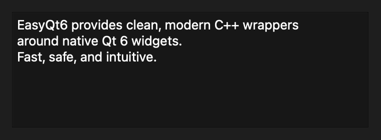

*Also known as:* `Memo`, `TextArea`.

| Function | What it does |
|---|---|
| `Textarea(text = "")` | Creates the box. |
| `get_text()` / `set_text(text)` | Read / replace all text. |
| `append_text(line)` | Add a new line at the end. |
| `set_placeholder(text)` | Grey hint while empty. |
| `set_read_only(true/false)` | Prevent typing. |
| `clear()` | Empty it. |
| `on_change(handler(text))` | Runs whenever the text changes. |

### TokenField — tags / chips

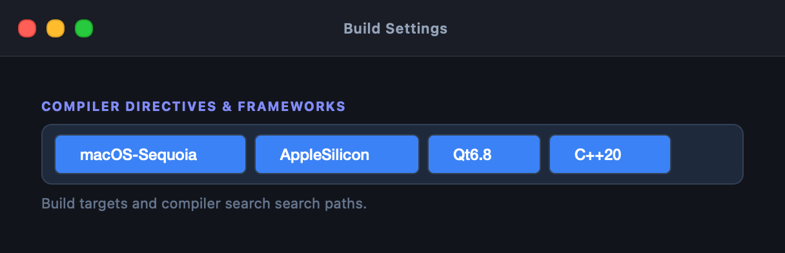

Type a word and press Enter: it becomes a removable "chip". Duplicates are ignored.

| Function | What it does |
|---|---|
| `TokenField(placeholder = "Type tag and press Enter...")` | Creates the field. |
| `add_token(text)` / `remove_token(text)` | Add / remove one tag. |
| `clear_tokens()` | Remove all tags. |
| `set_tokens({...})` / `tokens()` | Replace / read every tag. |
| `has_token(text)` | `true` if the tag exists. |
| `set_placeholder(text)` | Grey hint. |
| `on_tokens_changed(handler(list))` | Runs after tags are added or removed, with the new list. |

## Choices

### Checkbox

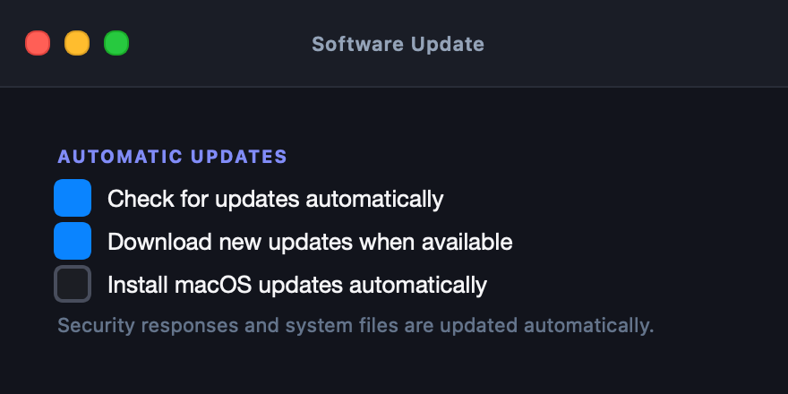

*Also known as:* `CheckBox`.

| Function | What it does |
|---|---|
| `Checkbox(text, checked = false)` | Creates a tick box. |
| `is_checked()` / `set_checked(true/false)` | Read / change the tick. |
| `set_text(text)` / `get_text()` | The caption. |
| `on_change(handler(bool checked))` | Runs when ticked or unticked. |

### Radio — pick one option

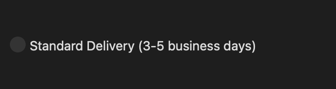

Radio buttons in the **same layout** form a group: choosing one un-chooses the others.
*Also known as:* `RadioButton`, `OptionButton`.

| Function | What it does |
|---|---|
| `Radio(text, checked = false)` | Creates an option. |
| `is_checked()` / `set_checked(true/false)` | Read / change it. |
| `set_text(text)` / `get_text()` | The caption. |
| `on_change(handler(bool checked))` | Runs when this option becomes selected or unselected. |

### ToggleSwitch

An animated on/off switch — see [Futuristic controls → ToggleSwitch](#toggleswitch).

### Dropdown — pick from a list

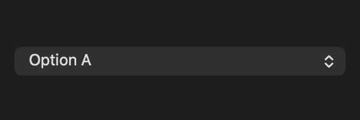

The user picks one item and **cannot** type their own value.

| Function | What it does |
|---|---|
| `Dropdown({items})` | Creates the list. |
| `add_item(text)` / `set_items({...})` / `items()` | Add one / replace all / read all items. |
| `clear()` / `count()` | Remove all / count items. |
| `get_selected()` / `set_selected(text)` | Read / choose the selected text (`""` = none). |
| `selected_index()` / `set_selected_index(i)` | Same by position (`-1` = none). |
| `on_change(handler(text))` | Runs when the user picks a different item. |

### ComboBox — pick or type

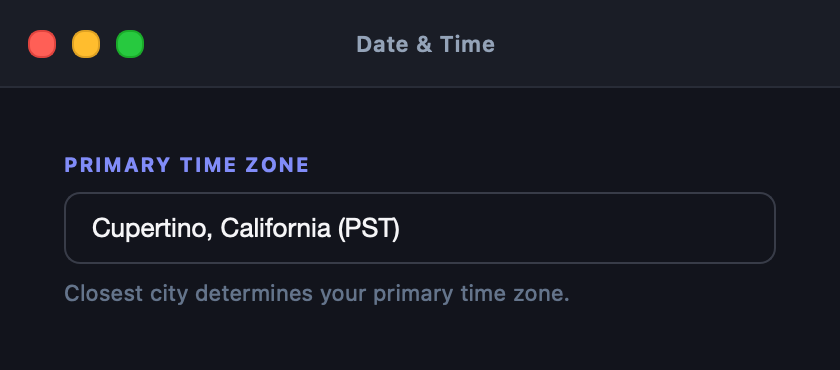

Like `Dropdown`, but the user may also type their own text.

| Function | What it does |
|---|---|
| `ComboBox({items})` | Creates the box. |
| `add_item(text)` / `set_items({...})` / `items()` / `clear()` | Manage the list. |
| `get_text()` / `set_text(text)` | Whatever is shown/typed. |
| `set_placeholder(text)` | Grey hint. |
| `on_change(handler(text))` | Runs when the text changes (picked or typed). |

### ListBox — a scrollable list

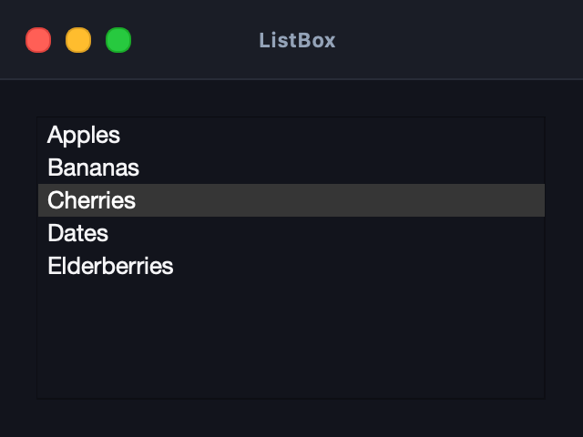

```cpp
auto fruit = std::make_shared<ListBox>(std::vector<std::string>{"Apple", "Banana"});
fruit->on_double_click([](int index, const std::string& text) { show_message(text); });
```

| Function | What it does |
|---|---|
| `ListBox({items})` | Creates the list. |
| `add_item(text)` | Add at the end. |
| `insert_item(index, text)` | Insert at a position. |
| `set_item(index, text)` | Change one row. |
| `remove_item(index)` | Remove one row (out-of-range is ignored). |
| `set_items({...})` / `items()` | Replace / read all rows. |
| `item(index)` | Text of one row (`""` if out of range). |
| `count()` | Number of rows. |
| `clear()` | Remove every row. |
| `selected_index()` / `selected_text()` | The selected row (`-1` / `""` = none). |
| `set_selected_index(index)` | Select a row (`-1` clears). |
| `set_sorted(true/false)` | Keep rows in alphabetical order. |
| `on_select(handler(index, text))` | Runs when the selection changes. |
| `on_double_click(handler(index, text))` | Runs when a row is double-clicked (or Enter is pressed). |

### SegmentedControl

A "Day | Week | Month" switch — see [Futuristic controls → SegmentedControl](#segmentedcontrol).

## Numbers, dates and colors

### Slider

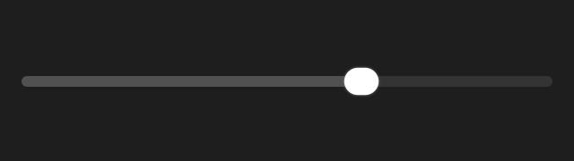

*Also known as:* `TrackBar`, `Scale`.

| Function | What it does |
|---|---|
| `Slider(min = 0, max = 100, value = 50)` | Creates the slider. |
| `get_value()` / `set_value(n)` | Read / change the value (kept inside the range). |
| `set_range(min, max)` | Change the range. |
| `set_vertical(true/false)` | Vertical instead of horizontal. |
| `on_change(handler(int value))` | Runs while it moves. |

### Knob

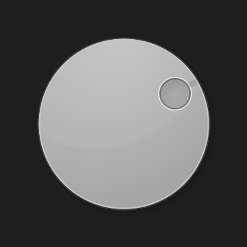

A round dial. *Also known as:* `Dial`.

| Function | What it does |
|---|---|
| `Knob(min = 0, max = 100, value = 0)` | Creates the knob. |
| `get_value()` / `set_value(n)` / `set_range(min, max)` | As `Slider`. |
| `on_change(handler(int value))` | Runs while it turns. |

### NumberInput

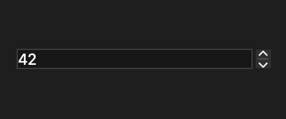

A box for whole numbers with up/down arrows. *Also known as:* `SpinEdit`, `SpinBox`, `NumericUpDown`.

| Function | What it does |
|---|---|
| `NumberInput(min = 0, max = 100, value = 0)` | Creates the box. |
| `get_value()` / `set_value(n)` / `set_range(min, max)` | Value and range. |
| `set_step(n)` | How much one arrow click changes the value. |
| `set_suffix(text)` | Text after the number, e.g. `" px"`. |
| `on_change(handler(int value))` | Runs when the value changes. |

### DatePicker

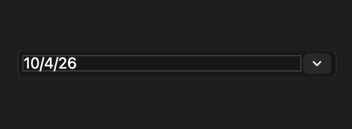

Dates are always text in the form `"YYYY-MM-DD"`, e.g. `"2026-10-31"`.
*Also known as:* `DateTimePicker`, `DateEdit`.

| Function | What it does |
|---|---|
| `DatePicker()` | Starts on today. |
| `DatePicker(date)` | Starts on a given date. |
| `get_date()` | The chosen date. |
| `set_date(date)` | Change it. Returns `false` (and changes nothing) if the date is not real. |
| `on_change(handler(date))` | Runs when the date changes. |

### DateRangePicker

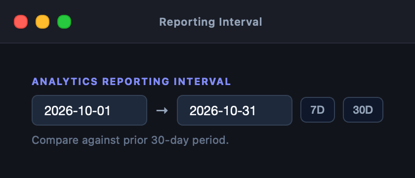

Two dates ("from" → "to") plus quick **7D** and **30D** buttons. Empty start = 7 days ago,
empty end = today.

| Function | What it does |
|---|---|
| `DateRangePicker(start = "", end = "")` | Creates the picker. |
| `set_start_date(date)` / `set_end_date(date)` | Change one end. Returns `false` if invalid. |
| `set_range(start, end)` | Change both. Returns `false` if invalid. |
| `set_last_days(n)` | End = today, start = today minus `n` days. |
| `start_date()` / `end_date()` | Read the dates. |
| `on_range_changed(handler(start, end))` | Runs when either date changes. |

### ColorWell

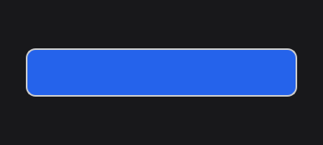

A colored button that opens the color picker. *Also known as:* `ColorButton`, `ColorBox`.

| Function | What it does |
|---|---|
| `ColorWell(color = "#FFFFFF")` | Creates the button. |
| `get_color()` | Always `"#rrggbb"`. |
| `set_color(color)` | Change it (invalid colors are ignored). |
| `on_change(handler(color))` | Runs after the user picks a color. |

### Rating — stars

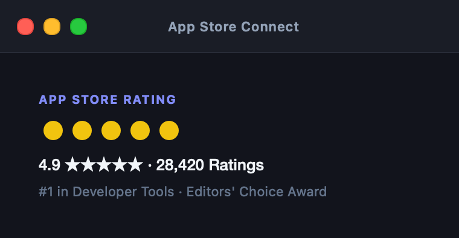

| Function | What it does |
|---|---|
| `Rating(max_stars = 5)` | Creates the stars. |
| `set_rating(n)` / `get_rating()` | Change / read (kept between 0 and max). |
| `max_stars()` | The number of stars. |
| `set_read_only(true/false)` | Display only — clicks are ignored. |
| `on_change(handler(int stars))` | Runs when the user clicks a star. |

### FeedbackMood — emoji faces

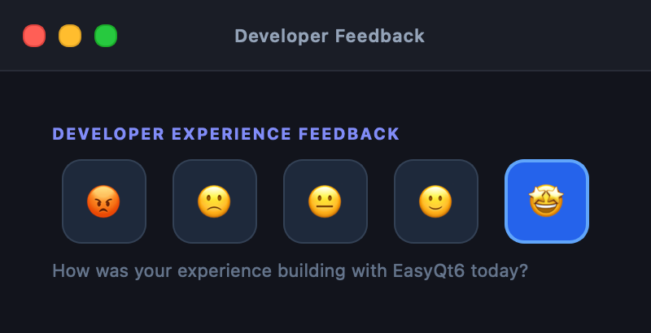

Five faces from angry (1) to delighted (5). `0` = nothing chosen.

| Function | What it does |
|---|---|
| `FeedbackMood(rating = 0)` | Creates the faces. |
| `set_rating(n)` / `rating()` | Change / read (0–5). |
| `on_change(handler(int rating))` | Runs when the user clicks a face. |

## Progress and status

### ProgressIndicator — a progress bar

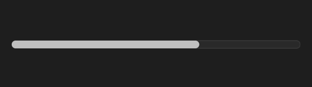

*Also known as:* `ProgressBar`.

| Function | What it does |
|---|---|
| `ProgressIndicator(min = 0, max = 100, value = 0)` | Creates the bar. |
| `get_value()` / `set_value(n)` / `set_range(min, max)` | Value and range. |
| `set_indeterminate(true/false)` | Endless "busy" animation when you don't know how long it takes. |
| `set_show_text(true/false)` | Show or hide the "42%" text. |

### CircularProgress — a progress ring

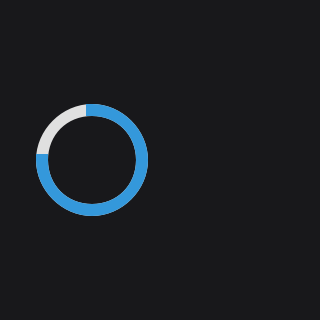

| Function | What it does |
|---|---|
| `CircularProgress()` | Creates the ring. |
| `set_value(percent)` / `get_value()` | 0–100. |
| `set_color(color)` | Ring color. |
| `set_show_text(true/false)` | Show "42%" in the middle. |
| `set_diameter(pixels)` | Size (default 60). |

### StatusPill

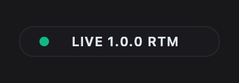

A rounded badge with a colored dot, e.g. **● LIVE**.

| Function | What it does |
|---|---|
| `StatusPill(text = "LIVE", dot_color = "#10b981")` | Creates the pill. |
| `set_status(text, dot_color)` | Change both at once. |
| `set_text(text)` / `text()` / `get_text()` | The word. |
| `set_color(dot_color)` | The dot color. |

### LedIndicator and RadialGauge

See [Futuristic controls](#futuristic-controls).

### VfdMeter — retro segment meter

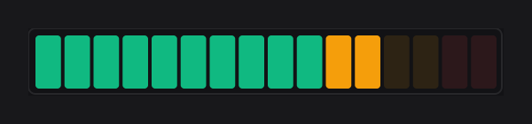

| Function | What it does |
|---|---|
| `VfdMeter(segments = 20, vertical = true)` | Creates the meter. |
| `set_value(percent)` / `get_value()` | 0–100. |
| `set_segments(count)` | Number of segments (minimum 3). |
| `set_glow(true/false)` | Glow effect. |

## Futuristic controls

Eight modern, animated controls for dashboards, sci-fi interfaces and control panels. They
look best with `app.set_theme("neon")`. Try the
[Mission Control example](../cpp/examples_shared/mission_control/main.cpp).

### ToggleSwitch

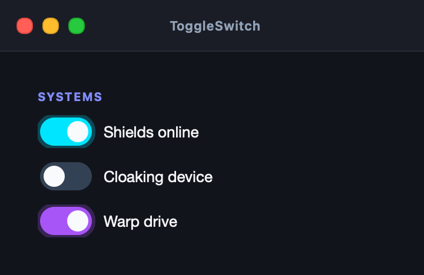

A smooth animated on/off switch. Click it, or press Space when it has focus. *Also known as:* `Switch`.

```cpp
auto wifi = std::make_shared<ToggleSwitch>(true, "Wi-Fi");
wifi->on_toggle([](bool on) { /* on = true or false */ });
```

| Function | What it does |
|---|---|
| `ToggleSwitch(on = false, label = "")` | Creates the switch. |
| `set_on(true/false)` / `is_on()` | Change / read (does not fire `on_toggle`). |
| `toggle()` | Flip it **and** fire `on_toggle`. |
| `set_text(label)` / `get_text()` | The caption. |
| `set_on_color(color)` | Track color when on (default cyan). |
| `on_toggle(handler(bool on))` | Runs when the switch is flipped. |

### RadialGauge

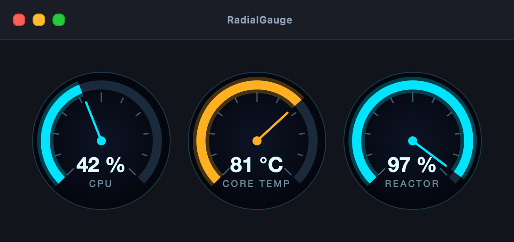

A sci-fi speedometer: glowing arc, needle and big number. The needle glides smoothly. The arc
turns amber above the *warning* level and red above the *danger* level. *Also known as:* `Gauge`.

```cpp
auto rpm = std::make_shared<RadialGauge>("ENGINE", 0, 8000);
rpm->set_units("RPM");
rpm->set_thresholds(6000, 7000);
rpm->set_value(3500);
```

| Function | What it does |
|---|---|
| `RadialGauge(title = "", min = 0, max = 100)` | Creates the gauge. |
| `set_value(n)` | Move the needle (kept inside the range). |
| `value()` / `get_value()` | Current value. |
| `set_range(min, max)` | Change the range. |
| `set_title(text)` | Small text under the number. |
| `set_units(text)` | e.g. `"%"`, `"km/h"`, `"°C"`. |
| `set_decimals(n)` | Digits after the decimal point (0–4). |
| `set_color(color)` | Normal arc color (default cyan). |
| `set_thresholds(warning, danger)` | Where amber and red start. Use the maximum to switch a zone off. |
| `set_animated(true/false)` | `false` = jump instantly. |

### NeonButton

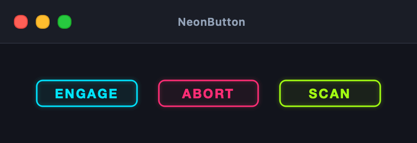

A glowing outlined button that lights up when the mouse is over it. Works exactly like
`Button` (including keyboard Space/Enter).

| Function | What it does |
|---|---|
| `NeonButton(text = "", color = "#00e5ff")` | Creates the button. |
| `set_text(text)` / `get_text()` | The caption. |
| `set_color(color)` | Glow and text color. |
| `click()` | Press it from code (fires `on_click`). |
| `on_click(handler())` | Runs when clicked. |

### LedIndicator

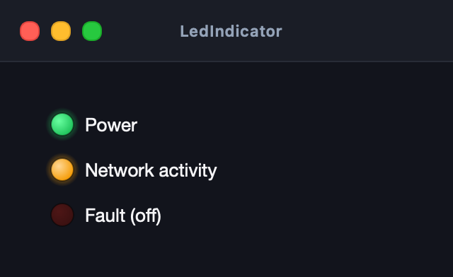

A small round status light, optionally blinking. *Also known as:* `Led`, `Lamp`.

| Function | What it does |
|---|---|
| `LedIndicator(color = "#22c55e", on = true)` | Creates the light. |
| `set_on(true/false)` / `is_on()` | Lit or dark. |
| `set_color(color)` | Light color. |
| `set_blinking(true/false, interval_ms = 500)` / `is_blinking()` | Blink on and off. |
| `set_diameter(pixels)` | Size (default 16). |
| `set_label(text)` | Optional text to the right. |

### RadarScope

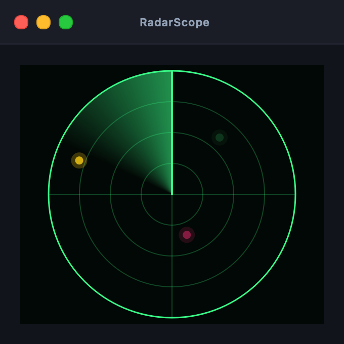

An animated radar screen with a rotating sweep and "blips". Angles are degrees: **0 = up**,
90 = right, clockwise. Distance is **0.0 (centre) to 1.0 (edge)**. It starts sweeping
automatically.

```cpp
auto radar = std::make_shared<RadarScope>();
int ship = radar->add_blip(45, 0.7);               // returns an id
radar->move_blip(ship, 60, 0.6);
```

| Function | What it does |
|---|---|
| `RadarScope()` | Creates the radar (already sweeping). |
| `start()` / `stop()` / `is_running()` | Control the sweep. |
| `set_sweep_speed(degrees_per_second)` | Default 90. |
| `set_color(color)` | Default green. |
| `add_blip(angle, distance, color = "")` | Adds a target and returns its id (up to 1000 blips). |
| `move_blip(id, angle, distance)` | Moves a target. |
| `remove_blip(id)` / `clear_blips()` | Remove one / all targets. |
| `blip_count()` | Number of targets. |

### TerminalView

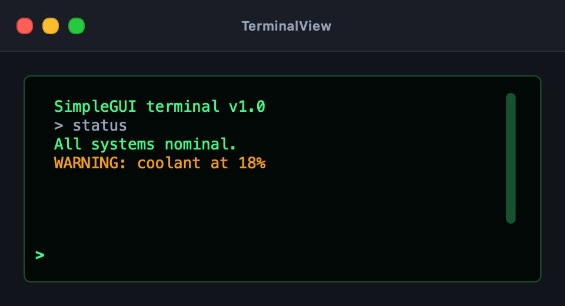

A retro-futuristic console: colored lines of output plus an optional command line. Up/Down
arrows recall earlier commands. Text is always shown as plain text. *Also known as:* `Console`.

```cpp
auto term = std::make_shared<TerminalView>();
term->print_line("SYSTEM ONLINE");
term->print_line("Low fuel!", "#f59e0b");
term->on_command([](const std::string& cmd) { /* user pressed Enter */ });
```

| Function | What it does |
|---|---|
| `TerminalView(show_input = true)` | Creates the console (with or without a command line). |
| `print_line(text, color = "")` | Adds one line. |
| `print(text, color = "")` | Adds text without starting a new line. |
| `clear()` | Erase everything. |
| `text()` / `get_text()` | Everything currently shown. |
| `set_max_lines(n)` | Drop the oldest lines beyond `n` (`0` = unlimited). |
| `set_prompt(text)` | Text before the command line (default `>`). |
| `set_input_visible(true/false)` | Show or hide the command line. |
| `set_output_color(color)` | Default color for printed text. |
| `on_command(handler(command))` | Runs when the user presses Enter on the command line. |

### SegmentedControl

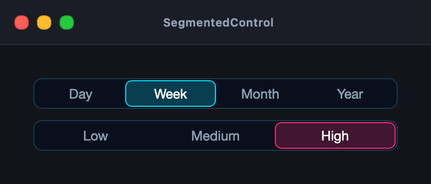

A row of joined buttons where exactly one is selected. Indexes start at 0.

| Function | What it does |
|---|---|
| `SegmentedControl({items}, selected = 0)` | Creates the control. |
| `set_items({...})` / `items()` / `count()` | Manage the segments (selection resets to 0). |
| `set_selected_index(i)` | Select one (does not fire `on_change`; unknown indexes are ignored). |
| `selected_index()` / `selected_text()` | The current choice (`-1` / `""` when empty). |
| `set_accent_color(color)` | Highlight color. |
| `on_change(handler(index, text))` | Runs when the user picks a different segment. |

### GlassPanel

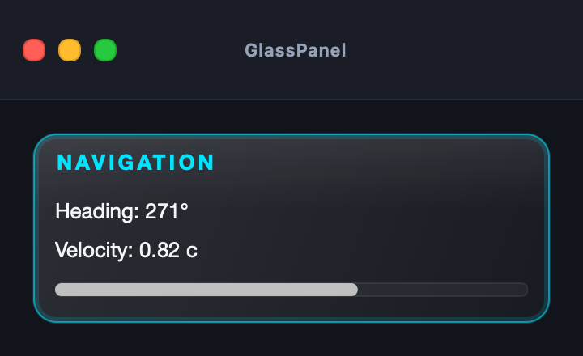

A frosted-glass card with a glowing border and optional title. It holds controls in a column,
exactly like a `VBox`.

| Function | What it does |
|---|---|
| `GlassPanel(title = "")` | Creates the panel (the title is shown in capitals). |
| `add_child(control, stretch = 0)` / `add_stretch(stretch = 0)` / `add_spacing(pixels)` | Same as `VBox`. |
| `remove_child(control)` / `clear()` / `child_count()` | Manage children. |
| `set_spacing(pixels)` / `set_margins(pixels)` | Gaps inside. |
| `set_title(text)` / `get_title()` | The title. |
| `set_accent_color(color)` | Border glow and title color. |

## Pictures and drawing

### Image

Shows a picture file (PNG, JPG, BMP, GIF, SVG). *Also known as:* `Picture`, `PictureBox`.

| Function | What it does |
|---|---|
| `Image(image_path = "")` | Creates the picture. |
| `set_image(image_path)` | Load a picture. Returns `false` if missing or not an image. |
| `set_scaled(true/false)` | Stretch to fill the control (keeps its shape). |

### Canvas — draw your own graphics

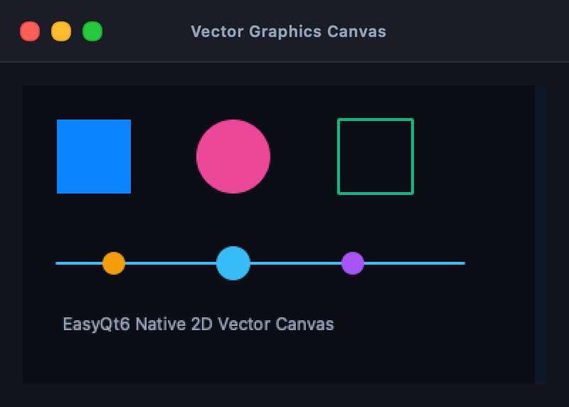

Coordinates are pixels; **(0, 0) is the top-left corner**, x grows right, y grows down.
Drawings stay until you call `clear()`. *Also known as:* `PaintBox`.

```cpp
auto canvas = std::make_shared<Canvas>(400, 300);
canvas->fill_circle(200, 150, 40, "orange");
canvas->draw_text(20, 30, "Hello", "white", 18);
canvas->on_mouse_down([canvas_ptr = canvas.get()](int x, int y) {
    canvas_ptr->fill_circle(x, y, 4, "cyan");     // draw where the user clicks
});
```

| Function | What it does |
|---|---|
| `Canvas(min_width = 300, min_height = 200)` | Creates the drawing area. |
| `clear(bg_color = "#0f172a")` | Erase everything with a background color. |
| `draw_point(x, y, color, size = 1)` | A dot. |
| `draw_line(x1, y1, x2, y2, color, line_width = 1)` | A line. |
| `draw_rect(x, y, w, h, color, line_width = 1)` / `fill_rect(x, y, w, h, color)` | Rectangle outline / filled. |
| `draw_rounded_rect(x, y, w, h, radius, color, line_width = 1)` / `fill_rounded_rect(x, y, w, h, radius, color)` | Rounded rectangle. |
| `draw_circle(cx, cy, radius, color, line_width = 1)` / `fill_circle(cx, cy, radius, color)` | Circle around a centre point. |
| `draw_ellipse(x, y, w, h, color, line_width = 1)` / `fill_ellipse(x, y, w, h, color)` | Oval inside a box. |
| `draw_text(x, y, text, color, font_size = 12)` | Text; (x, y) is the left end of the baseline. |
| `draw_image(x, y, file_path)` | Draw a picture. Returns `false` if it can't be loaded. |
| `save_to_file(file_path)` | Save the drawing as `.png`, `.jpg` or `.bmp`. Returns `false` on failure. |
| `repaint()` | Force a redraw (rarely needed). |
| `on_mouse_down(handler(x, y))` / `on_mouse_move(handler(x, y))` / `on_mouse_up(handler(x, y))` | Mouse events. |

## Tables

### Grid — a spreadsheet-style table

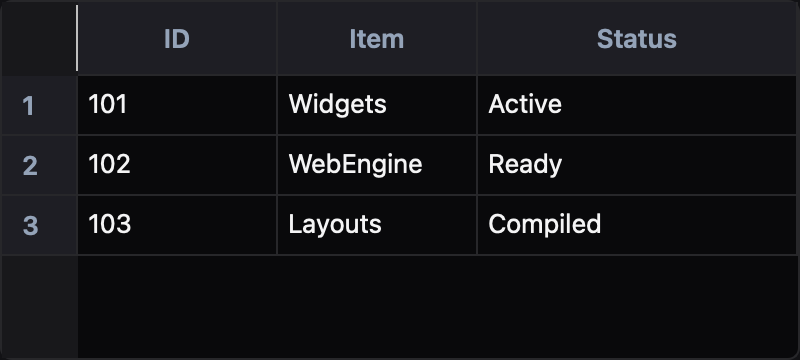

Rows and columns are counted from 0. Out-of-range cells are safely ignored.
*Also known as:* `StringGrid`, `Table`, `DataGrid`.

```cpp
auto grid = std::make_shared<Grid>(0, 3, std::vector<std::string>{"Name", "Age", "City"});
grid->add_row({"Ada", "36", "London"});
grid->on_select([grid_ptr = grid.get()](int row) {
    show_message("You picked " + grid_ptr->get_cell(row, 0));
});
```

| Function | What it does |
|---|---|
| `Grid(rows, cols, {headers})` | Creates the table. |
| `set_cell(row, col, text)` / `get_cell(row, col)` | Change / read one cell (`""` if out of range). |
| `add_row({values})` | Adds a row at the bottom and returns its number. |
| `remove_row(row)` | Removes one row. |
| `clear_rows()` | Removes every row (headers stay). |
| `set_row_count(n)` / `row_count()` / `column_count()` | Size of the table. |
| `set_headers({...})` | Column titles. |
| `selected_row()` / `set_selected_row(row)` | The selected row (`-1` = none). |
| `set_editable(true/false)` | Let the user type into cells (default: read-only). |
| `on_select(handler(int row))` | Runs when the user selects a row. |
| `on_cell_changed(handler(row, col, text))` | Runs after the user edits a cell. |

See also [ListBox](#listbox--a-scrollable-list) for a simple one-column list.

## Charts

All charts redraw automatically when you change their data. Leave a color empty (`""`) to use
the built-in palette.

### BarChart

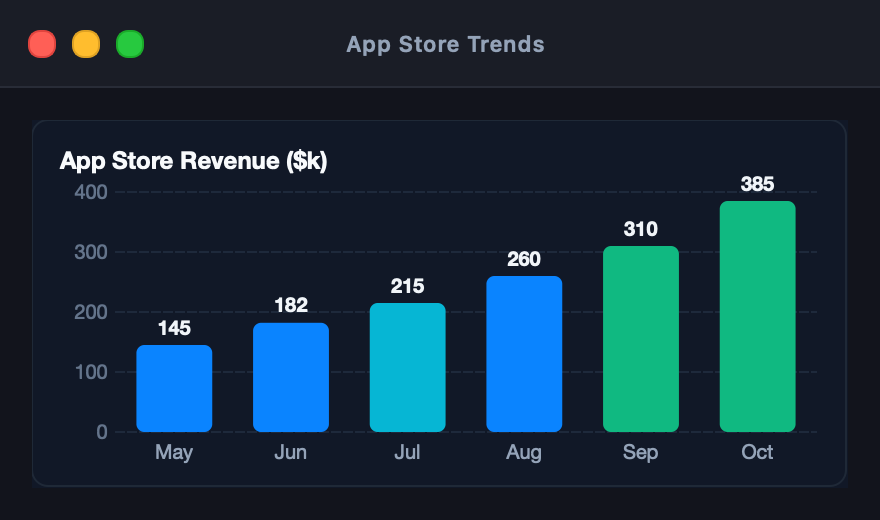

| Function | What it does |
|---|---|
| `BarChart(title = "")` | Creates the chart. |
| `add_bar(label, value, color = "")` | Adds a bar. |
| `set_bars({BarItem...})` | Replace all bars. `BarItem` has `label`, `value`, `color_hex`. |
| `set_value(index, value)` | Update one bar. |
| `clear_bars()` / `bar_count()` | Remove all / count bars. |
| `set_title(text)` | Chart title. |
| `set_show_values(bool)` / `show_values(bool)` | Numbers above the bars. |
| `set_show_grid(bool)` / `show_grid(bool)` | Dashed horizontal lines. |
| `set_y_range(min, max)` | Fix the vertical axis; `set_y_range(0, 0)` = automatic. |

### LineChart

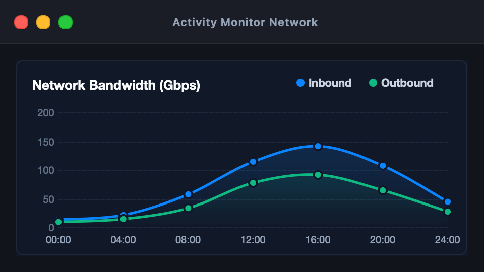

```cpp
auto chart = std::make_shared<LineChart>("Visitors");
chart->set_x_labels({"Mon", "Tue", "Wed"});
chart->add_series("This week", {120, 180, 150}, "#0a84ff");
```

| Function | What it does |
|---|---|
| `LineChart(title = "")` | Creates the chart. |
| `add_series(name, {values}, color = "", fill_gradient = true)` | Adds a line. |
| `set_series({LineSeries...})` | Replace all lines. `LineSeries` has `name`, `values`, `color_hex`, `fill_gradient`. |
| `set_x_labels({...})` | Labels along the bottom. |
| `clear_series()` | Remove all lines. |
| `set_title(text)` | Chart title. |
| `set_smooth(bool)` | Curved instead of straight lines. |
| `show_points(bool)` / `set_show_points(bool)` | Dots on each value. |
| `show_grid(bool)` / `set_show_grid(bool)` | Grid lines. |
| `show_legend(bool)` / `set_show_legend(bool)` | Series names. |
| `set_y_range(min, max)` | Fix the vertical axis. |

### PieChart

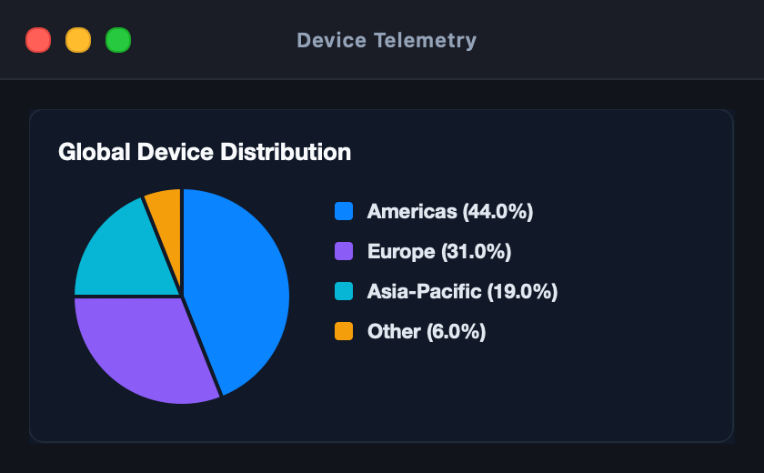

| Function | What it does |
|---|---|
| `PieChart(title = "")` | Creates the chart. |
| `add_slice(label, value, color = "")` | Adds a slice. |
| `set_slices({PieSlice...})` / `clear_slices()` | Replace / remove all. `PieSlice` has `label`, `value`, `color_hex`. |
| `set_title(text)` | Chart title. |
| `show_legend(bool)` / `set_show_legend(bool)` | Legend. |
| `show_percentages(bool)` / `set_show_percentages(bool)` | Percent labels. |

### DonutChart

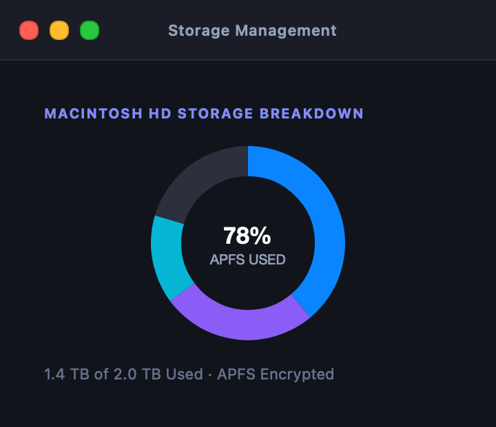

| Function | What it does |
|---|---|
| `DonutChart(center_title = "", center_subtitle = "")` | Creates the ring with text in the hole. |
| `add_segment(label, value, color)` | Adds a segment. |
| `set_segments({DonutSlice...})` / `clear_segments()` | Replace / remove all. `DonutSlice` has `label`, `value`, `color_hex`. |
| `set_center_text(title, subtitle = "")` | Text in the hole. |
| `set_thickness(pixels)` | Ring thickness. |

### RadarChart

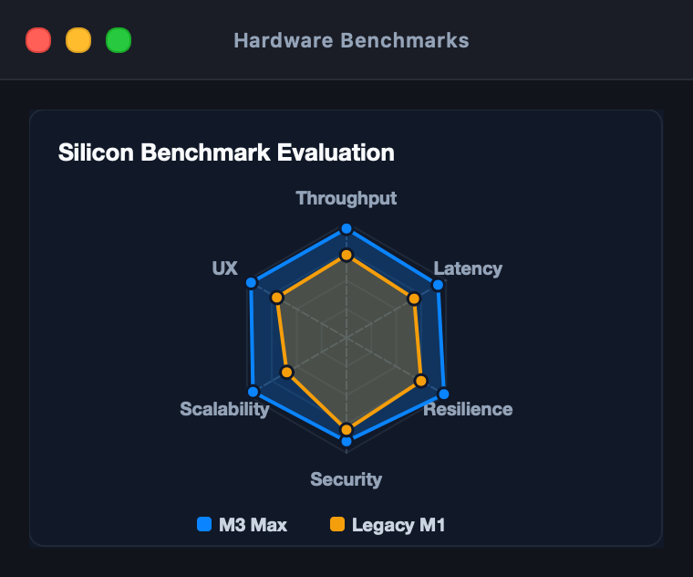

A spider-web chart comparing datasets across named dimensions (values 0–100).

| Function | What it does |
|---|---|
| `RadarChart(title = "")` | Creates the chart. |
| `set_dimensions({labels})` | The spokes, e.g. `{"Speed", "Power", "Range"}`. |
| `add_dataset(name, {values}, color = "")` | Adds a dataset. |
| `set_datasets({RadarDataset...})` | Replace all datasets. `RadarDataset` has `name`, `values`, `color_hex`. |
| `clear_datasets()` | Remove all. |
| `set_title(text)` | Chart title. |
| `show_legend(bool)` / `set_show_legend(bool)` | Legend. |

### CandlestickChart

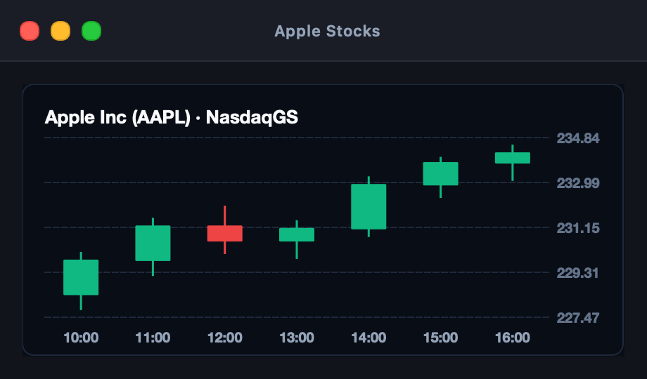

Stock-market candles (open, high, low, close). Green = closed higher, red = closed lower.

| Function | What it does |
|---|---|
| `CandlestickChart(title = "")` | Creates the chart. |
| `add_candle(label, open, high, low, close)` | Adds a candle. |
| `set_candles({CandleData...})` / `clear_candles()` | Replace / remove all. `CandleData` has `label`, `open`, `high`, `low`, `close`. |
| `set_title(text)` | Chart title. |
| `show_grid(bool)` / `set_show_grid(bool)` | Grid lines. |

### Sparkline

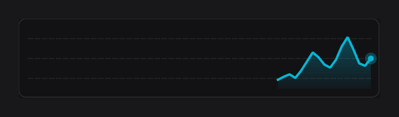

A tiny live graph — call `add_sample()` over time (pairs nicely with a [Timer](#timer-and-run_later)).

| Function | What it does |
|---|---|
| `Sparkline(color = "#06b6d4")` | Creates the graph. |
| `add_sample(value)` | Adds one value on the right. |
| `set_samples({...})` / `clear()` | Replace / remove all values. |
| `set_color(color)` | Line color. |
| `set_fill_enabled(bool)` | Shaded area under the line. |
| `set_range(min, max)` | Fix the vertical range. |
| `set_max_samples(n)` | Keep only the newest `n` values. |

### CompositionBar

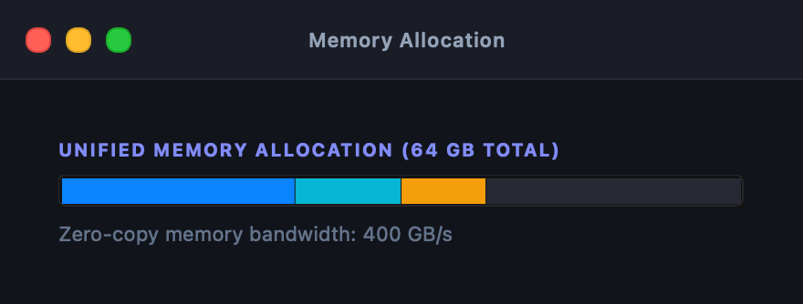

One bar split into colored parts (like a disk-usage bar).

| Function | What it does |
|---|---|
| `CompositionBar()` | Creates the bar. |
| `add_segment(label, value, color)` | Adds a part (width proportional to value). |
| `set_segments({CompositionSegment...})` | Replace all parts. `CompositionSegment` has `label`, `value`, `color`. |
| `clear_segments()` | Remove all parts. |

### ActivityHeatmap

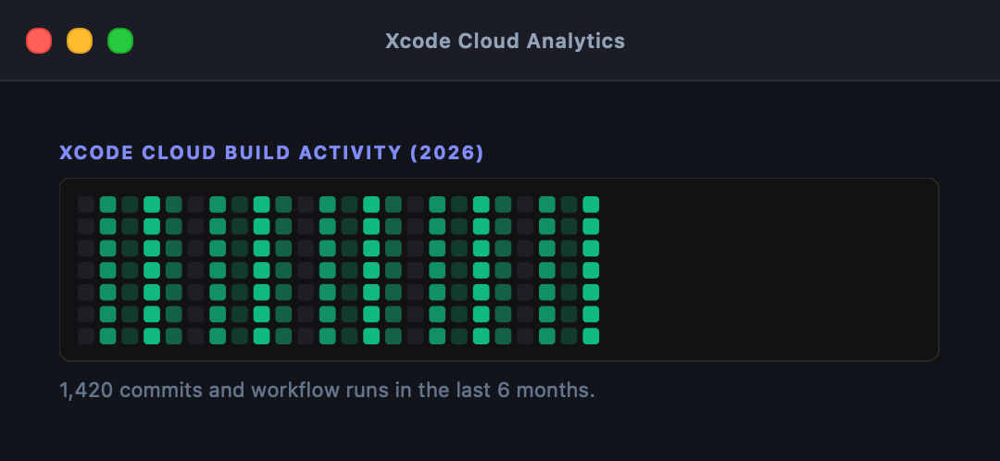

A GitHub-style grid of squares with intensity 0 (empty) to 4 (brightest).

| Function | What it does |
|---|---|
| `ActivityHeatmap(weeks = 16, days_per_week = 7)` | Creates the grid. |
| `set_data(matrix)` | `matrix[week][day]` = 0–4. |
| `set_cell(week, day, intensity)` / `get_cell(week, day)` | One square (out-of-range is ignored / returns 0). |
| `clear()` | All squares back to 0. |
| `set_color_scale(base_color)` | The brightest color, e.g. `"#10b981"`. |

## Dashboard and app widgets

### StatCard

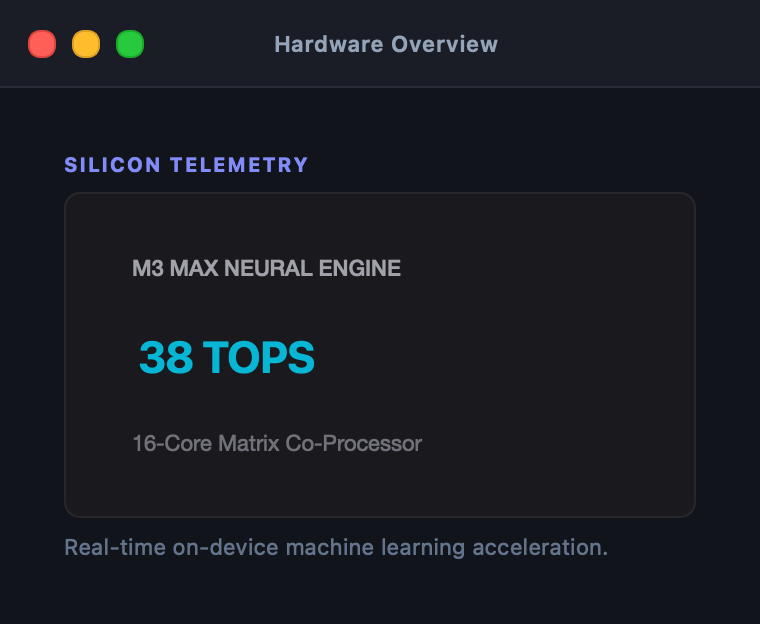

| Function | What it does |
|---|---|
| `StatCard(title, value, subtext = "", accent_color = "#3b82f6")` | A caption, big number and note. |
| `set_title(text)` / `set_value(text)` / `value()` | Caption and number. |
| `set_subtext(text)` | The note (`""` hides it). |
| `set_accent_color(color)` | Color of the big number. |

### StatGrid

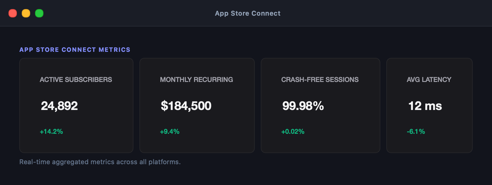

| Function | What it does |
|---|---|
| `StatGrid()` | A row of KPI tiles. |
| `add_stat(title, value, trend, is_positive = true)` | Adds a tile (trend green when positive, red when not). |
| `set_stats({StatItem...})` / `clear()` / `count()` | Replace / remove / count tiles. `StatItem` has `title`, `value`, `trend`, `is_positive`. |

### ProductCard

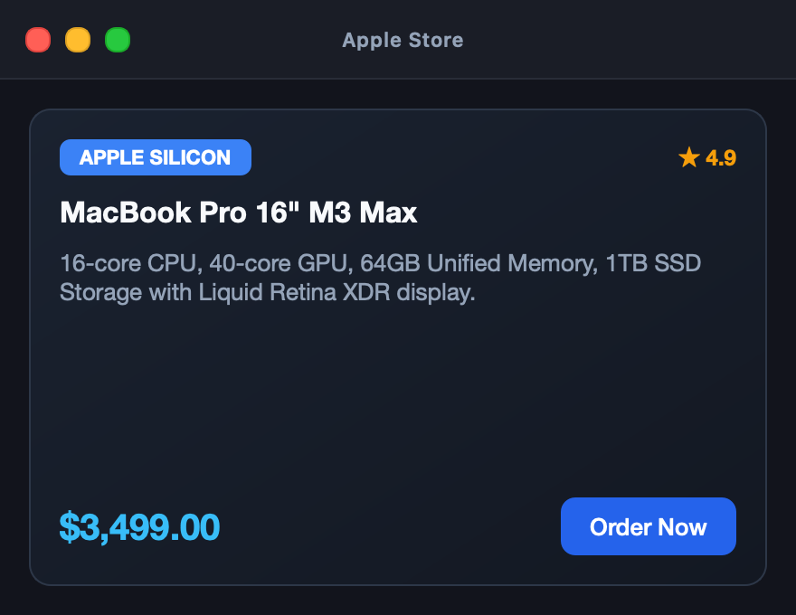

| Function | What it does |
|---|---|
| `ProductCard(title, description, price, badge = "", rating = 4.8, button_text = "Add to Cart")` | A shop card. Price is plain text, so any currency works. |
| `set_title` / `set_description` / `set_price` / `set_button_text` | Change the texts. |
| `set_badge(text)` | Corner badge (`""` hides it). |
| `set_rating(value)` | Shown as "★ 4.8". |
| `set_in_stock(true/false)` | `false` = disabled "Out of Stock" button. |
| `on_buy(handler())` | Runs when the button is clicked. |

### UserProfileCard

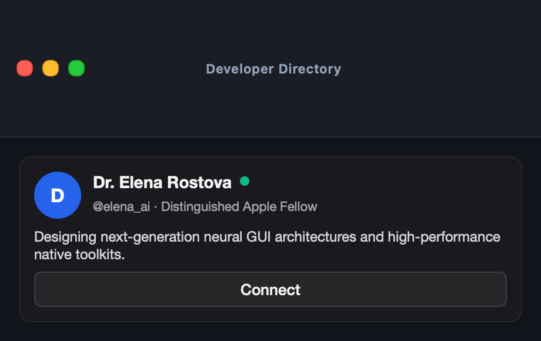

| Function | What it does |
|---|---|
| `UserProfileCard(name, handle, role, bio, is_online = true, action_label = "Connect")` | A profile card. |
| `set_online_status(bool)` / `is_online()` | Green or grey dot. |
| `set_bio(text)` / `set_action_text(text)` | Change texts. |
| `on_action(handler())` | Runs when the action button is clicked. |

### MediaPlayer

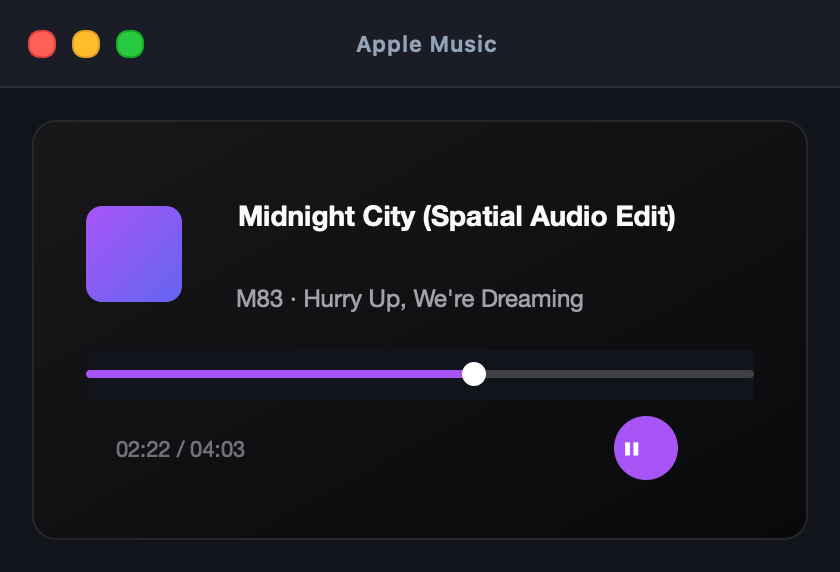

A music-player panel. **It is only the user interface — it does not play sound itself.**
Connect its events to your own playback code. Durations are `"mm:ss"` or `"h:mm:ss"`.

| Function | What it does |
|---|---|
| `MediaPlayer(title = "Song Title", artist = "Artist Name", duration = "03:45")` | Creates the panel. |
| `set_track(title, artist, duration)` | Show a new track. |
| `set_position(seconds)` / `set_position(seconds, total_seconds)` | Move the seek bar. |
| `position()` / `duration()` | Current / total seconds. |
| `set_playing(bool)` / `is_playing()` | Play or pause icon. |
| `on_play_pause(handler(bool playing))` | Play/pause clicked. |
| `on_seek(handler(int seconds))` | User dragged the seek bar. |
| `on_previous(handler())` / `on_next(handler())` | Skip buttons. |

### KanbanBoard

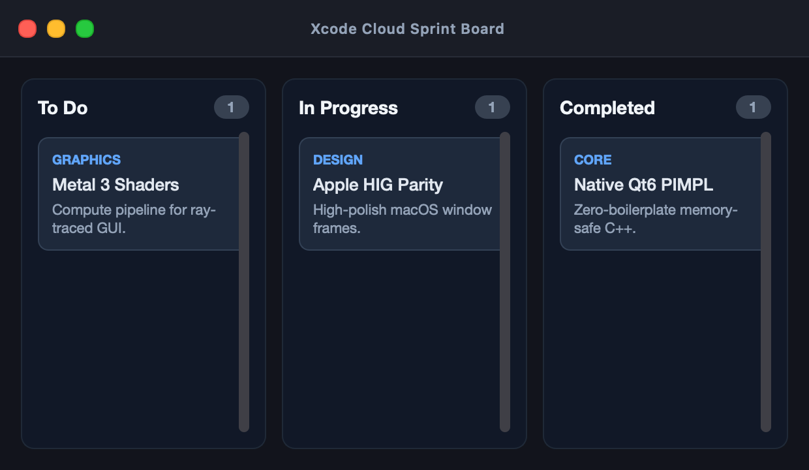

A task board with columns and cards. You choose the IDs (e.g. `"todo"`, `"task-42"`).

| Function | What it does |
|---|---|
| `KanbanBoard()` | Creates the board. |
| `add_column(id, title)` | Adds a column. Returns `false` if the id is empty or used. |
| `add_card(column_id, card_id, title, tag = "", description = "")` | Adds a card. Returns `false` on bad ids. |
| `move_card(card_id, column_id)` | Moves a card. Returns `false` (card stays put) if either id is unknown. |
| `remove_card(card_id)` | Removes a card. |
| `clear_column(column_id)` | Removes all cards in a column. |
| `card_ids(column_id)` | Card ids, top to bottom. |
| `card_column(card_id)` | Which column a card is in (`""` if unknown). |
| `on_card_clicked(handler(card_id))` | Runs when a card is clicked. |

### NavRail

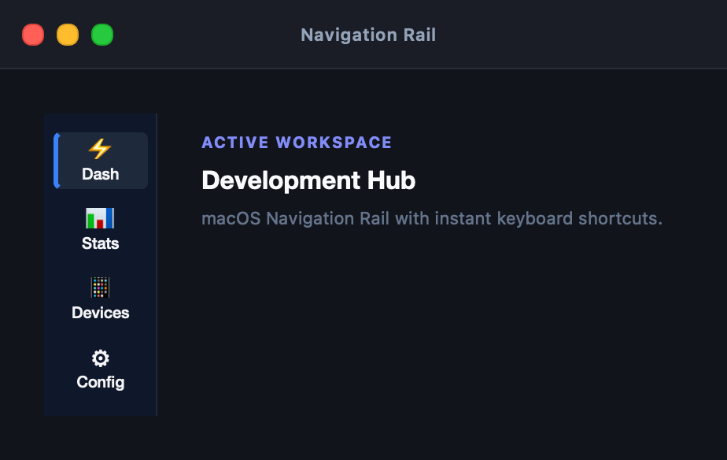

A slim vertical navigation bar. Each item has an id, an icon (any emoji/symbol), a label and an
optional red badge number.

| Function | What it does |
|---|---|
| `NavRail()` | Creates the bar. |
| `add_item(id, icon, label, badge = 0)` | Adds an item (the first becomes selected). Returns `false` on bad ids. |
| `set_badge(id, count)` | Badge number (`0` hides it). |
| `set_selected(id)` / `selected()` | The current item (does not fire `on_select`). |
| `on_select(handler(id))` | Runs when an item is clicked. |

### Breadcrumbs

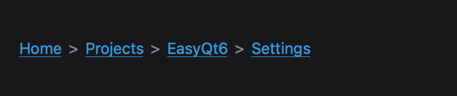

A clickable "you are here" path: Home › Projects › Report.

| Function | What it does |
|---|---|
| `Breadcrumbs({crumbs})` | Creates the path. |
| `set_crumbs({...})` / `crumbs()` | Replace / read the whole path. |
| `push(text)` / `pop()` | Add / remove the last part. |
| `on_click(handler(int index))` | Runs when a part is clicked (0 = first). |

## Web pages, PDFs and maps

These use the Chromium engine built into Qt (QtWebEngine). *WebView is also known as* `WebBrowser`.

### WebView

```cpp
auto web = std::make_shared<WebView>("https://example.com");
web->on_load_finished([](bool ok) { if (!ok) show_error("Page failed to load"); });
```

| Function | What it does |
|---|---|
| `WebView(url = "")` | Creates a browser panel. |
| `set_url(url)` / `url()` | Open / read the address. `"example.com"` becomes `https://example.com`. |
| `set_html(html, base_url = "")` | Show your own HTML text. |
| `back()` / `forward()` / `reload()` | Browser navigation. |
| `on_load_finished(handler(bool ok))` | Runs when a page finishes loading. |

### HtmlView

A `WebView` that starts with HTML text: `std::make_shared<HtmlView>("<h1>Hello</h1>")`. Has every `WebView` function.

### PdfView

| Function | What it does |
|---|---|
| `PdfView(pdf_path = "")` | Shows a PDF file. |
| `set_file(pdf_path)` | Open another PDF. Returns `false` if the file doesn't exist. |

Plus every `WebView` function.

### MapView

An interactive OpenStreetMap map with a marker (needs an internet connection). Latitude
-90…90, longitude -180…180.

| Function | What it does |
|---|---|
| `MapView(lat = 0, lng = 0, zoom = 13)` | Creates the map. |
| `set_coordinates(lat, lng)` | Move the map and marker. |
| `set_zoom(zoom)` | 1 (whole world) to 19 (street level). |

---

# Part 4 — Extra tools

## Dialogs

Ready-made pop-up windows. Each one **waits** until the user answers. Call them only after the
`Application` exists. All text is shown as plain text.

```cpp
show_message("Saved!");
if (ask_yes_no("Delete this file?")) { /* ... */ }
std::string name = input_box("What is your name?");
std::string file = open_file_dialog("Open", "Text files (*.txt)");
if (!file.empty()) { /* user picked a file */ }
```

| Function | What it does | Returns |
|---|---|---|
| `show_message(text, title = "Message")` | Plain message with OK. | — |
| `show_info(text, title = "Information")` | Message with an ℹ icon. | — |
| `show_warning(text, title = "Warning")` | Message with a ⚠ icon. | — |
| `show_error(text, title = "Error")` | Message with an ✖ icon. | — |
| `ask_yes_no(question, title = "Question")` | Yes / No buttons. | `true` = Yes |
| `ask_ok_cancel(question, title = "Confirm")` | OK / Cancel buttons. | `true` = OK |
| `input_box(prompt, title = "Input", default = "")` | Asks for text. | The text, or `default` on Cancel |
| `input_text(prompt, ok, title = "Input", default = "")` | Same, and sets the `bool ok` you pass in. | The text |
| `input_number(prompt, value = 0, min, max, title = "Input")` | Asks for a whole number. | The number, or `value` on Cancel |
| `input_choice(prompt, {choices}, title = "Choose")` | Pick from a list. | The choice, or `""` on Cancel |
| `open_file_dialog(title, filter, start_folder)` | Pick one file. | Path, or `""` |
| `open_files_dialog(title, filter, start_folder)` | Pick several files. | List of paths (empty on Cancel) |
| `save_file_dialog(title, filter, start_path)` | Choose where to save. | Path, or `""` |
| `select_folder_dialog(title, start_folder)` | Pick a folder. | Path, or `""` |
| `pick_color(initial = "#ffffff", title = "Select Color")` | Color picker. | `"#rrggbb"`, or `""` |

**File filters** look like `"Text files (*.txt)"` or, for several,
`"Images (*.png *.jpg);;All files (*)"`.

## Timer and run_later

A **Timer** runs code again and again (Delphi/Lazarus `TTimer`, VB `Timer`). It is invisible,
so you don't add it to a window. Keep it alive (e.g. as a variable in `main`) for as long as it
should run.

```cpp
Timer clock(1000);                         // every 1000 ms = 1 second
int seconds = 0;
clock.on_tick([&seconds, label]() {
    label->set_text(std::to_string(++seconds) + " s");
});
clock.start();
```

| Function | What it does |
|---|---|
| `Timer(interval_ms = 1000)` | Creates a stopped timer. |
| `set_interval(ms)` / `interval()` | Time between ticks (minimum 1 ms). |
| `start()` / `stop()` / `is_running()` | Control it. |
| `set_enabled(true/false)` | Delphi style: `true` = start, `false` = stop. |
| `set_single_shot(true/false)` | Tick only once per `start()`. |
| `on_tick(handler())` | Runs on every tick. |

**run_later** runs code once after a delay, with no Timer needed:

```cpp
run_later(2000, []() { show_message("Two seconds passed"); });
```

## Familiar names (aliases)

Each alias is **exactly the same class** under another name — mix them freely.

| Alias(es) | Same as | Comes from |
|---|---|---|
| `CommandButton`, `PushButton` | `Button` | VB, Qt |
| `BitBtn`, `SpeedButton` | `ImageButton` | Delphi, Lazarus |
| `StaticText` | `Label` | Lazarus |
| `Edit`, `TextBox`, `LineEdit` | `TextInput` | Delphi/Lazarus, VB, Qt |
| `PasswordEdit` | `PasswordInput` | |
| `Memo`, `TextArea` | `Textarea` | Delphi/Lazarus, V/HTML |
| `MaskEdit` | `MaskedInput` | Delphi/Lazarus |
| `HyperLink`, `LinkLabel` | `Link` | WinForms |
| `CheckBox` | `Checkbox` | Delphi/Lazarus/VB |
| `RadioButton`, `OptionButton` | `Radio` | Delphi/Lazarus, VB |
| `Switch` | `ToggleSwitch` | |
| `TrackBar`, `Scale` | `Slider` | Delphi/Lazarus/WinForms |
| `SpinEdit`, `SpinBox`, `NumericUpDown` | `NumberInput` | Lazarus, Qt, WinForms |
| `ProgressBar` | `ProgressIndicator` | Delphi/Lazarus/VB |
| `Dial` | `Knob` | |
| `Gauge` | `RadialGauge` | |
| `Led`, `Lamp` | `LedIndicator` | |
| `DateTimePicker`, `DateEdit` | `DatePicker` | Delphi/WinForms, Lazarus |
| `ColorButton`, `ColorBox` | `ColorWell` | Lazarus |
| `Picture`, `PictureBox` | `Image` | VB/WinForms |
| `PaintBox` | `Canvas` | Delphi/Lazarus |
| `StringGrid`, `Table`, `DataGrid` | `Grid` | Delphi/Lazarus |
| `Column`, `Panel` | `VBox` | V `ui.column`, Delphi/Lazarus |
| `Row` | `HBox` | V `ui.row` |
| `Frame` | `GroupBox` | VB |
| `PageControl`, `TabControl`, `Notebook` | `TabView` | Delphi/Lazarus, WinForms |
| `ScrollBox`, `ScrollArea` | `ScrollView` | Delphi/Lazarus, Qt |
| `Splitter` | `SplitView` | Delphi/Lazarus |
| `WebBrowser` | `WebView` | Delphi/VB |
| `Console` | `TerminalView` | |

## Styling with style sheets

For most needs, use the simple functions: `set_text_color`, `set_background_color`,
`set_font_size`, `set_bold`, `set_font`, and the [themes](#themes).

For full control, `set_style()` accepts a Qt style sheet (similar to CSS):

```cpp
button->set_style("background-color: #0a84ff; color: white; border-radius: 6px; padding: 6px 14px;");
```

You can also target the control by its name:

```cpp
box->set_name("toolbar");
box->set_style("QWidget#toolbar { background: #1a1d26; border-bottom: 1px solid #282c37; }");
```

`app.set_stylesheet(...)` applies a style sheet to the whole program. Colors and fonts set with
the simple functions are kept when you call `set_style`.

## Safety built in

SimpleGUI is designed so that ordinary mistakes or untrusted text can't hurt your program:

- **Text is plain text.** Labels, list items, tags, terminal output, dialog messages and chart
  labels never interpret HTML, so text from users or files can't inject links or formatting.
- **Colors are checked.** Invalid color text is ignored and can't break or inject styles.
- **Links are restricted.** `Link` only opens `http`, `https` and `mailto` addresses.
- **Bounds are checked.** Out-of-range rows, cells, indexes and ids are ignored instead of
  crashing (Grid, ListBox, ActivityHeatmap, KanbanBoard, BarChart…).
- **Memory is managed.** Controls are freed automatically; event tickets are safe to use after
  a control is gone. Canvas images are capped at 8192 × 8192 pixels.
- **MapView** loads its map library with integrity hashes (SRI) from a trusted CDN.

Your own code should still validate anything it saves, sends or executes.

## Example programs

| Folder | What it shows |
|---|---|
| [`examples_shared/mission_control`](../cpp/examples_shared/mission_control/main.cpp) | Futuristic dashboard: neon theme, Timer, RadialGauge, RadarScope, TerminalView, LedIndicator, ToggleSwitch, NeonButton, GlassPanel, SegmentedControl, Sparkline |
| [`examples_shared/classic_rad`](../cpp/examples_shared/classic_rad/main.cpp) | Delphi/VB style: `Edit`, `Memo`, `CheckBox`, `ListBox`, names + `find`, menus with shortcuts, status bar, dialogs, `on_close` |
| [`examples_macos/`](../cpp/examples_macos) | hello_world, minimal, login_form, calculator, web_browser, settings_dashboard, data_explorer, system_monitor, analytics_dashboard |
| [`examples_linux/`](../cpp/examples_linux) | hello_world, calculator, system_monitor, software_center, terminal_config |
| [`examples_windows/`](../cpp/examples_windows) | hello_world, calculator, system_monitor, settings_dashboard |
| [`tools/screenshot_generator`](../cpp/tools/screenshot_generator/main.cpp) | Renders every screenshot in this guide |

After building, programs are in `cpp/build/<folder>/<name>/`. On macOS the `examples_macos`
programs are app bundles: `open cpp/build/examples_macos/calculator/example_calculator.app`.

## Troubleshooting and FAQ

**CMake says it can't find Qt6.**
Pass `-DCMAKE_PREFIX_PATH=<your Qt folder>` (see [Installing](#installing-and-building)). Make
sure the *WebEngine* module is installed.

**My window opens and immediately closes / nothing appears.**
Check that you call `window.show()` and end `main` with `return app.run();`.

**A control doesn't appear.**
It must be added to a layout (`add_child`) that is inside the window (`set_content`).

**My event handler never runs.**
Make sure you didn't call `disconnect()` on its ticket, and that the function you use to change
the value isn't one marked "does not fire".

**"error: 'label' is not captured".**
Put the control's name inside the lambda's square brackets: `[label]() { ... }`.

**Using `window` or a `Timer` inside a handler.**
Capture it by reference with `&`: `[&window]() { window.close(); }`.

**Text with `<b>` shows the tags literally.**
That's intentional — SimpleGUI always shows plain text for safety.

**How do I run something every second?** Use a [Timer](#timer-and-run_later).

**How do I keep the screen responsive during a long loop?**
Call `Application::process_events()` inside the loop, or split the work up with a Timer.

**Tip for long-running programs:** if a handler needs *the same control it is attached to*,
capture a raw pointer instead of the shared pointer, e.g.
`canvas->on_mouse_down([c = canvas.get()](int x, int y) { c->draw_point(x, y); });`.
Capturing the control itself keeps it alive until its window closes.

## Advanced: mixing in raw Qt

Every control has `get_qwidget()`, which returns the underlying Qt widget. You only need this
if you want to combine SimpleGUI with hand-written Qt code; most programs never use it, and
SimpleGUI's own headers never require you to include Qt.

```cpp
#include <QWidget>
QWidget* w = button->get_qwidget();   // advanced use only
```
